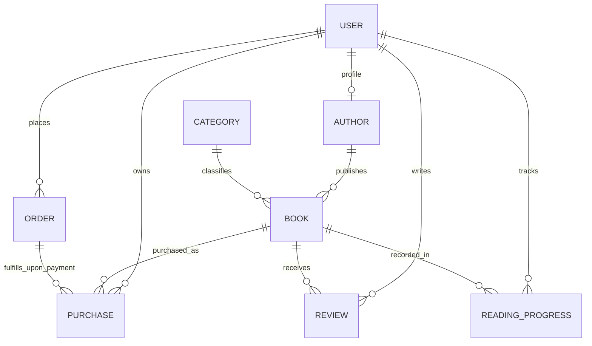

# PROJECT OVERVIEW — Ebook Platform

> **Single Source of Truth** for human software engineers and AI coding agents.  
> Last Updated: 2026-10-08  
> Repository: `iam-AmirKhan/ebook-platform`  
> Current Branch: `main`

---

## 1. Core Project Vision

### 1.1 Project Identity
- **Project Name:** Ebook Platform
- **Target Market:** Bangladesh
- **Core Purpose:** A production-ready, Bangladesh-focused digital ebook reading, selling, and publishing marketplace.

### 1.2 Business Vision
The platform aims to become the leading digital book platform in Bangladesh by providing a frictionless, secure, and delightful experience for book readers, independent authors, and publishers.

- **Readers:** Discover books, read verified previews, purchase digital books via domestic payment methods (starting with mock testing in MVP, scaling to local MFS/cards), maintain a lifetime personal digital library, and read directly inside a protected web reader with persistent reading progress.
- **Authors & Publishers:** Submit writer applications, upload manuscripts/ebooks, pass admin moderation, track real-time book sales and reader engagements, and earn royalties through an automated commission model.
- **Platform Administrators:** Full oversight of users, author onboarding, content moderation, category taxonomy, financial order audits, review moderation, and business analytics.

### 1.3 Scope Strategy
- **Stage 1 (MVP & Product-Market Validation):** Clean full-stack Next.js core, MongoDB persistence, secure authentication, catalog discovery, user library, mock payment abstraction, and a protected in-browser reader with casual piracy safeguards.
- **Stage 2 (Growth & Commercialization):** Official SSLCOMMERZ integration (Bangladesh MFS: bKash, Nagad, Rocket, cards), author marketplace onboarding, royalty payouts, and advanced reader DRM/watermarking.

---

## 2. Architecture & Technology Stack

The platform is strictly designed around a **Single Full-Stack Next.js Application**. All client UI, Server Components, Server Actions, Route Handlers, and backend services reside in this repository.

> [!IMPORTANT]
> **NO Separate Express.js or Node Server:** Do NOT create a standalone Express or backend process. All server logic is executed via Next.js App Router (Server Actions and Route Handlers).

### 2.1 Technology Matrix (Implemented vs Planned)

| Layer | Technology | Status | Implementation Details / Scope |
| :--- | :--- | :--- | :--- |
| **Framework** | Next.js `16.3.8` (App Router) | **IMPLEMENTED** | Server Components, Server Actions, dynamic Route Handlers, Turbopack. |
| **UI Library** | React `19.2.8` / React DOM `19.2.8` | **IMPLEMENTED** | Strict mode, client and server component boundaries. |
| **Language** | TypeScript `^5` | **IMPLEMENTED** | Strict typing across models, actions, validators, and components (`@/*` alias). |
| **Styling** | Tailwind CSS `^4` | **IMPLEMENTED** | Configured via `@tailwindcss/postcss` and PostCSS; CSS theme variables. |
| **UI Primitives** | `shadcn/ui` / Radix Primitives | **IMPLEMENTED** | Base component primitives (e.g. `Button` in `src/components/ui/button.tsx`). |
| **Database** | MongoDB Atlas | **IMPLEMENTED** | Cloud document database connected via Mongoose ODM. |
| **ODM / Client** | Mongoose `^9.11.0` | **IMPLEMENTED** | Cached serverless singleton connection pool in `src/lib/db/mongoose.ts`. |
| **Data Models** | Mongoose Schemas (8 Core Models) | **IMPLEMENTED** | `User`, `Category`, `Author`, `Book`, `Order`, `Purchase`, `Review`, `ReadingProgress`. |
| **Auth Engine** | Auth.js (`next-auth` `^5.0.0-beta.32`) | **IMPLEMENTED** | JWT session strategy, credentials verification against Mongoose, App Router handler. |
| **Password Security**| `bcryptjs` `^3.0.3` | **IMPLEMENTED** | 12 salt rounds hashing and verification in `src/lib/auth/password.ts`. |
| **Input Validation** | Zod `^4.6.5` | **IMPLEMENTED** | Strict schema validation for auth payloads (`src/validators/auth.ts`). |
| **Client Forms** | React Hook Form `^7.89.0` + `@hookform/resolvers` | **IMPLEMENTED** | Client-side form management with Zod resolvers (`login`, `register`). |
| **OAuth Provider** | Google OAuth (`GoogleProvider`) | **CONFIGURED (INCOMPLETE)** | Provider structure configured in `src/lib/auth/auth.ts`; consent flow not yet completed. |
| **Public Assets** | Cloudinary CDN | **PLANNED** | For book covers, author profile photos, and marketing media. |
| **Private Ebooks** | Cloudflare R2 | **PLANNED** | Private S3-compatible bucket for PDF/EPUB storage via signed time-limited URLs. |
| **Payment (MVP)** | Manual bKash/Nagad Verification | **DESIGNED (PHASE 6)** | Reader submits external payment evidence (transaction ID + phone) → Admin manual verification dashboard → Atomic Purchase fulfillment via MongoDB transactions. No payment API integration required. Complete audit trails with reviewer tracking. |
| **Payment (Live)**| SSLCOMMERZ | **FUTURE (PHASE 12)** | Production Bangladesh gateway (bKash, Nagad, cards). Requires merchant registration and API integration. |
| **Ebook Reader** | Web Canvas / PDF Viewer + Watermarking | **PLANNED** | Protected in-browser reader with dynamic user metadata overlay and progress autosync. |
| **Hosting Target** | Cloudflare Workers / Edge | **PLANNED** | Edge deployment target; application maintains standard Web/Node runtime portability. |

---

## 3. Current Project Status

### 3.1 Status Summary

| Phase | Title | Status | Evidence / Verification |
| :---: | :--- | :---: | :--- |
| **Phase 1** | Database Foundation & Core Models | **COMPLETE** | Cached connection pool in `src/lib/db/mongoose.ts`; all 8 Mongoose models implemented and committed. |
| **Phase 2A** | Auth.js Foundation | **COMPLETE** | `next-auth` v5 beta installed; JWT strategy configured in `src/lib/auth/auth.ts`. |
| **Phase 2B** | Credentials Authentication | **COMPLETE** | `bcryptjs` password hashing, Zod validation, `registerUser` server action, and `CredentialsProvider` authorize logic. |
| **Phase 2C** | Authentication UI | **COMPLETE** | `/login` and `/register` client pages built with React Hook Form and Zod. |
| **Phase 2D** | Session Helpers & Protected Route | **COMPLETE** | `getCurrentUser` & `requireUser` in `src/lib/auth/session.ts`; protected `/account` page; Route Handler in `src/app/api/auth/[...nextauth]/route.ts`. End-to-end verified. |

### 3.2 Phases 2E-6 Status

| Phase | Title | Status | Evidence / Verification |
| :---: | :--- | :---: | :--- |
| **Phase 2E** | Google OAuth | **PENDING** | Configure Google Cloud Console project, callback URIs, environment credentials. Verify OAuth sign-in and account linking. |
| **Phase 2F** | Role-Based Authorization | **PENDING** | Implement server-side role guards (`USER`, `AUTHOR`, `ADMIN`) for protected actions, routes, and layout wrappers. |
| **Phase 3** | Main Website UI & Design System | **PENDING** | Build navigation header, footer, homepage hero, featured books carousel. |
| **Phase 4** | Public Book Marketplace | **PENDING** | Implement book catalog with search, filtering, book details view, free preview sample viewer. |
| **Phase 5** | User Library & Dashboard | **PENDING** | Build authenticated reader dashboard, purchased book shelf, reading progress indicators. |
| **Phase 6** | Manual bKash/Nagad Payment Verification | **DESIGNED** | Complete manual verification workflow: Reader payment submission → Admin verification dashboard → Atomic Purchase fulfillment. MongoDB transactions ensure data consistency. Unique compound indexes prevent duplicate transaction IDs. Complete audit trails with administrator tracking. No payment gateway API integration required. SSLCOMMERZ reserved for Phase 12 automated integration. |

### 3.3 Next Immediate Phases

1. **Phase 2E — Google OAuth:** Complete Google Cloud Console project setup, configure callback URIs, provide environment credentials, and verify OAuth sign-in and account linking.
2. **Phase 2F — Role-Based Authorization:** Implement server-side role guards (`USER`, `AUTHOR`, `ADMIN`) for protected actions, routes, and layout wrappers.

---

## 4. Implemented Database Models (`src/models/`)

All 8 core models are implemented in `src/models/` using Mongoose schemas with strict TypeScript typing, validation, indexes, and hot-reload model caching.

### 4.1 Model Specifications

#### 1. `User` (`src/models/User.ts`)
- **Responsibility:** Master account records for authentication, identity, and authorization.
- **Fields:**
  - `name`: `String` (required, trimmed)
  - `email`: `String` (required, unique, lowercase, trimmed)
  - `image`: `String | null` (optional avatar URL)
  - `passwordHash`: `String | null` (bcrypt hash; null for pure OAuth users)
  - `role`: `"USER" | "AUTHOR" | "ADMIN"` (required, default `"USER"`)
  - `status`: `"ACTIVE" | "SUSPENDED" | "DELETED"` (required, default `"ACTIVE"`)
  - `timestamps`: `createdAt`, `updatedAt`

#### 2. `Category` (`src/models/Category.ts`)
- **Responsibility:** Book genre and classification taxonomy.
- **Fields:**
  - `name`: `String` (required, trimmed)
  - `slug`: `String` (required, unique, lowercase, trimmed)
  - `description`: `String | null` (optional description)
  - `image`: `String | null` (optional category banner)
  - `status`: `"ACTIVE" | "INACTIVE"` (required, default `"ACTIVE"`)
  - `timestamps`: `createdAt`, `updatedAt`

#### 3. `Author` (`src/models/Author.ts`)
- **Responsibility:** Public author profile linked to an approved user account.
- **Fields:**
  - `user`: `ObjectId -> User` (required, unique 1-to-1 link)
  - `penName`: `String` (required, trimmed)
  - `slug`: `String` (required, unique, lowercase, trimmed)
  - `bio`: `String | null` (biography text)
  - `profileImage`: `String | null` (author avatar URL)
  - `status`: `"ACTIVE" | "INACTIVE"` (required, default `"ACTIVE"`)
  - `timestamps`: `createdAt`, `updatedAt`

#### 4. `Book` (`src/models/Book.ts`)
- **Responsibility:** Ebook catalog metadata, pricing, and content linkage.
- **Fields:**
  - `title`: `String` (required, trimmed)
  - `slug`: `String` (required, unique, lowercase, trimmed)
  - `description`: `String` (required, trimmed)
  - `coverImage`: `String | null` (public cover image URL)
  - `author`: `ObjectId -> Author` (required)
  - `category`: `ObjectId -> Category` (required)
  - `price`: `Number` (required, min 0)
  - `discountPrice`: `Number | null` (optional, min 0)
  - `currency`: `String` (required, default `"BDT"`)
  - `contentUrl`: `String | null` (private Cloudflare R2 object key)
  - `status`: `"DRAFT" | "PUBLISHED" | "ARCHIVED"` (required, default `"DRAFT"`)
  - `timestamps`: `createdAt`, `updatedAt`

#### 5. `Order` (`src/models/Order.ts`)
- **Responsibility:** Transient payment transaction lifecycle with manual verification workflow.
- **Fields:**
  - `user`: `ObjectId -> User` (required, indexed)
  - `items`: Array of `{ book: ObjectId -> Book, title: String, price: Number, quantity: Number }` (min 1 item)
  - `subtotal`: `Number` (required, min 0)
  - `discount`: `Number` (required, default 0, min 0)
  - `total`: `Number` (required, min 0)
  - `currency`: `String` (required, default `"BDT"`)
  - `paymentMethod`: `"BKASH" | "NAGAD" | "MOCK" | "SSLCOMMERZ"` (required)
  - `status`: `"PENDING" | "PAYMENT_SUBMITTED" | "PAID" | "REJECTED" | "CANCELLED" | "REFUNDED"` (required, default `"PENDING"`)
  - `submittedTransactionId`: `String | null` (external payment transaction ID)
  - `submittedPhoneNumber`: `String | null` (sender phone number for verification)
  - `submittedAt`: `Date | null` (when reader submitted payment evidence)
  - `reviewedBy`: `ObjectId -> User | null` (admin who reviewed payment)
  - `reviewedAt`: `Date | null` (when admin reviewed)
  - `rejectionReason`: `String | null` (admin rejection explanation)
  - `submissionHistory`: Array of submission entries for complete audit trail
  - `timestamps`: `createdAt`, `updatedAt`

#### 6. `Purchase` (`src/models/Purchase.ts`)
- **Responsibility:** Durable, auditable digital ownership record granting reader access.
- **Crucial Rule:** `ORDER ≠ PURCHASE`. A `Purchase` is created only after an `Order` is verified as `PAID`.
- **Fields:**
  - `user`: `ObjectId -> User` (required, indexed)
  - `book`: `ObjectId -> Book` (required, indexed)
  - `order`: `ObjectId -> Order` (required, indexed)
  - `price`: `Number` (required, min 0)
  - `currency`: `String` (required, default `"BDT"`)
  - `status`: `"ACTIVE" | "REFUNDED" | "CANCELLED"` (required, default `"ACTIVE"`)
  - `purchasedAt`: `Date` (required, default `Date.now`)
  - `timestamps`: `createdAt`, `updatedAt`
  - **Indexes:** Compound index on `{ user: 1, book: 1 }` for rapid ownership authorization checks.

#### 7. `Review` (`src/models/Review.ts`)
- **Responsibility:** User rating and review feedback for published books.
- **Fields:**
  - `user`: `ObjectId -> User` (required)
  - `book`: `ObjectId -> Book` (required)
  - `rating`: `Number` (required, 1 to 5)
  - `comment`: `String` (required, trimmed)
  - `status`: `"PUBLISHED" | "HIDDEN"` (required, default `"PUBLISHED"`)
  - `timestamps`: `createdAt`, `updatedAt`
  - **Indexes:** Unique compound index on `{ user: 1, book: 1 }` (enforces maximum 1 review per user per book).

#### 8. `ReadingProgress` (`src/models/ReadingProgress.ts`)
- **Responsibility:** Real-time bookmarking and reading progression tracking.
- **Fields:**
  - `user`: `ObjectId -> User` (required)
  - `book`: `ObjectId -> Book` (required)
  - `progress`: `Number` (required, 0 to 100, default 0)
  - `currentPage`: `Number` (required, min 1, default 1)
  - `completed`: `Boolean` (required, default `false`)
  - `lastReadAt`: `Date` (required, default `Date.now`)
  - `timestamps`: `createdAt`, `updatedAt`
  - **Indexes:** Unique compound index on `{ user: 1, book: 1 }`.

### 4.2 Entity Relationship Diagram (Mermaid)



---

## 5. Implemented Authentication Architecture

Authentication is powered by **Auth.js v5 (`next-auth@5.0.0-beta.32`)** and follows a zero-client-trust security model.

### 5.1 Architecture Details

- **Configuration:** Defined in `src/lib/auth/auth.ts`, exporting `{ handlers, signIn, signOut, auth }`.
- **Session Strategy:** Explicit `jwt` strategy (required when operating with custom Mongoose persistence).
- **Credentials Provider:**
  - Implements `authorize(credentials)` extracting sanitized email and password.
  - Queries MongoDB `User` model using `.lean()`.
  - Compares plaintext passwords against `user.passwordHash` using `bcrypt.compare` via `src/lib/auth/password.ts`.
  - Verifies `user.status === "ACTIVE"`. Inactive/suspended accounts are rejected.
- **Google OAuth Provider:**
  - Defined in `src/lib/auth/auth.ts` using `GOOGLE_CLIENT_ID` and `GOOGLE_CLIENT_SECRET`.
  - **Status:** Skeleton configured; full production OAuth flow and consent screens are pending Phase 2E.
- **JWT & Session Callbacks:**
  - User ID, `role` (`"USER" | "AUTHOR" | "ADMIN"`), and `status` (`"ACTIVE" | "SUSPENDED" | "DELETED"`) are attached to JWT during sign-in and propagated to `session.user`.
- **Route Handler:**
  - Implemented at `src/app/api/auth/[...nextauth]/route.ts` exporting `{ GET, POST } = handlers`.
  - Handles `/api/auth/providers`, `/api/auth/csrf`, `/api/auth/signin`, `/api/auth/callback`, and `/api/auth/signout`.
- **Server-Side Session Helpers (`src/lib/auth/session.ts`):**
  - `getCurrentUser()`: Asynchronously resolves the active session user or returns `null`.
  - `requireUser()`: Enforces authentication on Server Components; redirects unauthenticated requests to `/login` via Next.js `redirect("/login")`.
- **Sign Out:**
  - Implemented via Server Action invoking `signOut({ redirectTo: "/login" })`, clearing cookies and revoking active session tokens.

---

## 6. Actual Routes vs Planned Routes

### 6.1 Currently Implemented Routes

| Route | Type | Status / Scope | Access Control |
| :--- | :--- | :--- | :--- |
| `/` | Page | **Starter Home** (Create Next App starter template; will be replaced by marketplace landing) | Public |
| `/login` | Page | **Implemented Auth UI** (Email/password form, React Hook Form, Zod resolver, `signIn("credentials")`) | Guest only |
| `/register` | Page | **Implemented Auth UI** (Name, email, password, confirm password, calls `registerUser` Server Action) | Guest only |
| `/account` | Page | **Implemented Protected Page** (Displays user profile details and sign-out button; currently acts as verification route for Phase 2D) | Authenticated (`USER` / `AUTHOR` / `ADMIN`) |
| `/api/auth/[...nextauth]` | Route Handler | **Implemented Auth API** (Auth.js App Router handler for all session, provider, callback, and signout requests) | Public |

### 6.2 Planned Target Routes (Future Roadmap)

| Route | Type | Purpose | Planned Phase |
| :--- | :--- | :--- | :--- |
| `/` | Page | Marketplace landing, featured books, hero section, recommendations | Phase 4 |
| `/books` | Page | Catalog search, category filter, price sorting, pagination | Phase 4 |
| `/books/[slug]` | Page | Book details, free sample preview, author details, reviews, buy button | Phase 4 |
| `/authors/[slug]` | Page | Author biography and published book list | Phase 4 |
| `/categories/[slug]` | Page | Category-filtered catalog view | Phase 4 |
| `/checkout/[orderId]` | Page | Order review, payment method selection, mock payment trigger | Phase 6 |
| `/dashboard/library` | Page | User purchased ebook shelf with cover grid and reading progress | Phase 5 |
| `/dashboard/orders` | Page | User order and payment invoice history | Phase 5 |
| `/dashboard/profile` | Page | User profile editing, avatar upload, password change | Phase 5 |
| `/reader/[bookId]` | Page | Protected in-browser web reader with dynamic watermark overlay | Phase 7 |
| `/admin` | Page | Platform analytics, revenue, orders, and user management | Phase 8 |
| `/admin/books` | Page | Book moderation, publication approvals, pricing audits | Phase 8 |
| `/admin/authors` | Page | Author registration applications review and approvals | Phase 8 |
| `/admin/orders` | Page | Financial transaction audit logs and status overrides | Phase 8 |
| `/admin/reviews` | Page | Customer review moderation and visibility toggles | Phase 8 |
| `/author/dashboard` | Page | Author earnings, royalties, book upload and edit forms | Phase 9 |
| `/api/payments/mock` | Route | Development callback endpoint for mock payment simulation | Phase 6 |
| `/api/payments/callback` | Route | Production payment gateway webhook receiver | Phase 11 |
| `/api/reader/[bookId]` | Route | Authenticated, time-limited ebook streaming endpoint | Phase 7 |

---

## 7. Current Project Directory Structure

```
ebook-platform/
├── .env.example                         # Environment template documentation
├── .env.local                           # Local environment secrets (GIT-IGNORED)
├── eslint.config.mjs                    # ESLint 9 configuration
├── next.config.ts                       # Next.js configuration
├── package.json                         # Dependencies and build scripts
├── postcss.config.mjs                   # PostCSS configuration for Tailwind v4
├── PROJECT_OVERVIEW.md                  # Authoritative architectural documentation
├── tsconfig.json                        # TypeScript strict compiler configuration
│
├── public/                              # Static public assets (icons, SVGs)
│
└── src/
    ├── actions/                         # Server Actions (Mutations)
    │   └── auth.ts                      # registerUser server action with Zod validation
    │
    ├── app/                             # Next.js App Router
    │   ├── account/
    │   │   └── page.tsx                 # Protected user account verification page
    │   ├── api/
    │   │   └── auth/
    │   │       └── [...nextauth]/
    │   │           └── route.ts         # Auth.js App Router dynamic route handler
    │   ├── login/
    │   │   └── page.tsx                 # Client login form
    │   ├── register/
    │   │   └── page.tsx                 # Client registration form
    │   ├── favicon.ico
    │   ├── globals.css                  # Tailwind v4 styles and theme tokens
    │   ├── layout.tsx                   # Root layout with Geist font
    │   └── page.tsx                     # Starter home page (to be replaced by marketplace)
    │
    ├── components/                      # Reusable UI components
    │   └── ui/
    │       └── button.tsx               # shadcn/ui button primitive
    │
    ├── lib/                             # Core services & utilities
    │   ├── auth/
    │   │   ├── auth.ts                  # Auth.js configuration, callbacks & providers
    │   │   ├── password.ts              # bcryptjs password hashing and verification
    │   │   └── session.ts               # Server session helpers (getCurrentUser, requireUser)
    │   ├── db/
    │   │   └── mongoose.ts              # Cached singleton MongoDB Atlas connection pool
    │   └── utils.ts                     # Tailwind class merging utility (clsx + twMerge)
    │
    ├── models/                          # Mongoose Schemas & Models (ALL IMPLEMENTED)
    │   ├── Author.ts                    # Author profile schema
    │   ├── Book.ts                      # Ebook catalog schema
    │   ├── Category.ts                  # Category taxonomy schema
    │   ├── Order.ts                     # Transaction checkout lifecycle schema
    │   ├── Purchase.ts                  # Granted ebook ownership schema
    │   ├── ReadingProgress.ts           # Reading progression & bookmark schema
    │   ├── Review.ts                    # User book review & rating schema
    │   └── User.ts                      # User account & authentication schema
    │
    ├── types/                           # Shared TypeScript type definitions
    │
    └── validators/                      # Zod Validation Schemas
        └── auth.ts                      # RegisterSchema & auth input types
```

---

## 8. Security Principles

1. **Zero Client Trust:** Never trust client-sent role, pricing, payment confirmation, or book ownership claims.
2. **Mandatory Server Validation:** All inputs entering mutations must be strictly parsed with Zod schemas.
3. **Cryptographic Password Security:** Plaintext passwords must never be stored or logged. Always use `bcryptjs` with a work factor of 12 rounds.
4. **Credential Isolation:** Never expose `.env.local`, API secrets, database connection strings, or private storage keys. Never commit environment files to version control.
5. **Decoupled Ebook Storage:** Ebooks must be kept in private buckets (Cloudflare R2) with zero public read permissions. Access is strictly granted via server-authorized, expiring URLs.
6. **Authorization Barriers:** Admin and Reader routes must verify session and access permissions at the server level before rendering or dispatching data.
7. **Idempotent Payment Processing:** Webhooks and callback handlers must verify transaction integrity and ensure an order cannot be credited multiple times.
8. **Dynamic Reader Watermarking:** Readers render subtle, dynamic overlays containing user-identifying metadata to deter casual screencaps.

---

## 9. Environment Variables Reference

*(Template only — no real secrets are stored in this document)*

```env
# Node / Next.js
NODE_ENV=development
NEXT_PUBLIC_APP_URL=http://localhost:3000

# Database (MongoDB Atlas)
MONGODB_URI=mongodb+srv://...

# Authentication (Auth.js v5)
AUTH_SECRET=
GOOGLE_CLIENT_ID=
GOOGLE_CLIENT_SECRET=

# Public Media Storage (Cloudinary - Covers, Avatars)
CLOUDINARY_CLOUD_NAME=
CLOUDINARY_API_KEY=
CLOUDINARY_API_SECRET=

# Private Ebook Storage (Cloudflare R2 - Private Files)
CLOUDFLARE_ACCOUNT_ID=
CLOUDFLARE_R2_ACCESS_KEY_ID=
CLOUDFLARE_R2_SECRET_ACCESS_KEY=
CLOUDFLARE_R2_BUCKET_NAME=

# Payment Gateway (Manual Verification Only - No API Keys Required)
# Future Production Gateway (Phase 12 - SSLCOMMERZ)
SSLCOMMERZ_STORE_ID=
SSLCOMMERZ_STORE_PASSWORD=
SSLCOMMERZ_IS_SANDBOX=true
```

---

## 10. Development Roadmap

- **Phase 1: Database Foundation & Core Models — COMPLETE**
  - Cached singleton MongoDB Mongoose connection for serverless.
  - Implemented all 8 schemas: `User`, `Category`, `Author`, `Book`, `Order`, `Purchase`, `Review`, `ReadingProgress`.
- **Phase 2A: Auth.js Foundation — COMPLETE**
  - Configured Auth.js v5 with JWT session strategy and Mongoose integration.
- **Phase 2B: Credentials Authentication — COMPLETE**
  - Implemented bcrypt password hashing (12 rounds), Zod registration validator, `registerUser` server action, and CredentialsProvider.
- **Phase 2C: Authentication UI — COMPLETE**
  - Built `/login` and `/register` client pages with React Hook Form and Zod resolvers.
- **Phase 2D: Session Helpers & Protected Routes — COMPLETE**
  - Implemented `getCurrentUser` and `requireUser` session helpers.
  - Built protected `/account` page and App Router route handler (`src/app/api/auth/[...nextauth]/route.ts`).
  - End-to-end verified login, registration, logout, and protected redirection.
- **Phase 2E: Google OAuth (Current / Next Planned)**
  - Configure Google Cloud OAuth 2.0 Client credentials, consent screen, callback routing, and account linking.
- **Phase 2F: Role-Based Authorization**
  - Implement server-side role guards (`USER`, `AUTHOR`, `ADMIN`) for actions and protected layouts.
- **Phase 3: Main Website UI & Design System**
  - Build navigation header, footer, homepage hero, featured books carousel, and category showcase.
- **Phase 4: Public Book Marketplace**
  - Implement book catalog with search, filtering, book details view, and free preview sample viewer.
- **Phase 5: User Library & Dashboard**
  - Build authenticated reader dashboard, purchased book shelf, and reading progress indicators.
- **Phase 6: Manual bKash/Nagad Payment Verification (DESIGNED)**
  - Complete manual payment workflow with atomic transaction processing.
  - Reader submits external payment evidence (transaction ID, sender phone number).
  - Admin verification dashboard with approval/rejection workflow and audit trails.
  - MongoDB transactions ensure atomic Order status updates and Purchase record creation.
  - Unique compound indexes prevent transaction ID duplication across users.
  - Complete submission history tracking with administrator identity and timestamps.
  - Payment method support: BKASH and NAGAD (manual verification), MOCK (development only).
  - No payment gateway API integration required - manual verification eliminates technical complexity.
  - Self-approval prevention enforced via database-level checks.
  - Configurable payment instructions display (account numbers, reference codes) without API credentials.
  - Backward compatibility maintained for existing MOCK orders during development.
- **Phase 7: Protected Ebook Reader**
  - Build secure in-browser reader with server authorization, dynamic user watermarking, and reading progress auto-sync.
- **Phase 8: Admin Dashboard**
  - Administrative panel for book catalog approvals, author onboarding moderation, transaction audit reviews, and user management.
- **Phase 9: Author Marketplace**
  - Enable author onboarding, book/manuscript upload forms, royalty dashboards, and sales analytics.
- **Phase 10: Storage Integrations (Cloudinary & Cloudflare R2)**
  - Implement public cover image uploads to Cloudinary and private encrypted ebook file uploads to Cloudflare R2.
- **Phase 11: Production Hardening & Cloudflare Deployment**
  - Optimize build performance, configure caching headers, verify edge runtime compatibility, and execute security audits.
- **Phase 12: Production Payment Gateway (SSLCOMMERZ)**
  - Implement `SSLCommerzPaymentProvider`, hook up production IPN webhooks, test Bangladeshi MFS, and go live.

---

## 11. Git Strategy & Development Workflow

To maintain repository integrity and cleanliness, all contributors and AI agents must follow this strict workflow:

### 11.1 Workflow Rules
1. **AI Agents Do NOT Auto-Commit:** AI coding assistants must NEVER run `git commit` or `git push` automatically. The user reviews changes and executes commits.
2. **Atomic, Feature-Based Commits:** Keep commits small, focused, and scoped to a single feature or fix.
3. **Pre-Commit Verification:** Always execute and verify the following commands before committing:
   - `npx tsc --noEmit` (Strict TypeScript check)
   - `npm run lint` (ESLint check)
   - `npm run build` (Next.js production build verification)
4. **Secret Protection:** Never commit `.env`, `.env.local`, or any secrets/keys to version control.
5. **Authoritative Consultation:** Always review `PROJECT_OVERVIEW.md` before planning or implementing structural changes.

### 11.2 Conventional Commit Format
`<type>(<scope>): <subject>`

- `feat(auth): add google oauth provider integration`
- `feat(catalog): implement book list and search filters`
- `fix(auth): handle expired session token redirect`
- `chore(docs): update project overview architecture state`

---

## 12. Architecture Decision Log (ADR)

| Decision | Context | Rationale | Status |
| :--- | :--- | :--- | :--- |
| **Unified Next.js App** | Full-Stack Architecture | Eliminates overhead of maintaining two separate repositories or an Express server. Next.js App Router natively supports Route Handlers and Server Actions. | Approved & Implemented |
| **MongoDB + Mongoose** | Data Persistence | Flexible document model matching book metadata, rich nested structures, and rapid iteration requirements. | Approved & Implemented |
| **Auth.js v5 (next-auth)**| Authentication | Official Next.js authentication framework supporting JWT sessions, Credentials, and OAuth without proprietary lock-in. | Approved & Implemented |
| **Separate `Purchase` from `Order`** | Domain Modeling | `Order` reflects transient payment lifecycles; `Purchase` reflects durable, auditable digital content entitlements. | Approved & Implemented |
| **Target Cloudflare Workers & R2** | Production Hosting & Storage | Global low-latency edge performance, zero egress fees for private ebook storage via R2, tight security controls. | Approved (Planned) |
| **Cloudinary for Images** | Media Management | Automatic image optimization, responsive resizing, and global CDN delivery for public covers and avatars. | Approved (Planned) |
| **Manual Payment Gateway** | Payment Strategy | Human administrators act as the trust boundary, manually verifying payment transactions against bKash/Nagad merchant accounts before granting digital ownership. This eliminates technical payment integration complexity while maintaining security rigor through atomic database operations and comprehensive audit trails. | Approved (Designed) |
| **SSLCOMMERZ in Phase 12** | Local Payment Gateway | Industry-standard Bangladeshi gateway supporting bKash, Nagad, cards; deferred until market demand is validated. | Approved (Future) |

---

## 13. AI Agent Development Contract

All AI coding assistants working in this repository must strictly adhere to the following rules:

1. **Consult `PROJECT_OVERVIEW.md`** before making any architectural or structural changes.
2. **Do not introduce Express.js** as a separate backend under any circumstances.
3. **Do not replace MongoDB/Mongoose** without explicit user approval.
4. **Do not introduce Prisma, Firebase, or Supabase** without explicit approval.
5. **Do not install unapproved npm packages.**
6. **Never integrate live payment APIs** during Phase 6; use manual verification workflow with MongoDB transactions.
7. **Never trust client-supplied payment, ownership, or role claims.**
8. **Never expose API keys, database connection strings, or storage credentials.**
9. **Never expose `passwordHash`** in client responses, JWT tokens, or public queries.
10. **Implement comprehensive audit trails** with administrator tracking for all payment decisions.
11. **Build incrementally** in accordance with the documented Roadmap phases.
12. **Run `npx tsc --noEmit`, `npm run lint`, and `npm run build`** after significant changes to confirm build integrity.
13. **Do NOT run `git commit` or `git push`** — leave committing to the user after verification.
14. **Distinguish currently implemented features from planned architecture** in all responses.
