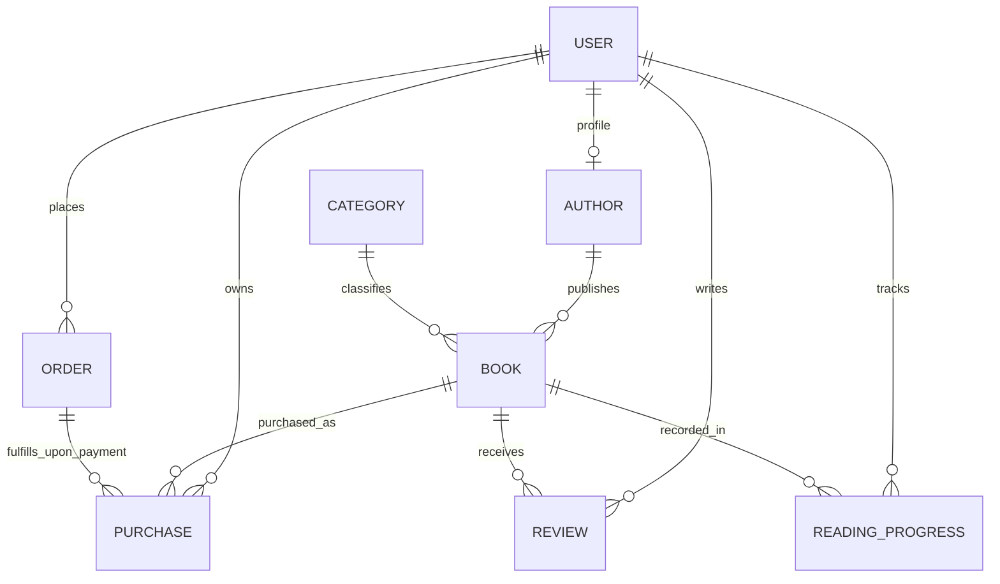

# PROJECT OVERVIEW — Ebook Platform

> **Single Source of Truth** for human software engineers and AI coding agents.  
> Last Updated: 2026-10-06  
> Repository: `iam-AmirKhan/ebook-platform`

---

## 1. Core Project Vision

### 1.1 Project Identity
- **Project Name:** Ebook Platform
- **Target Market:** Bangladesh
- **Core Purpose:** A production-ready, Bangladesh-focused digital ebook reading, selling, and publishing marketplace.

### 1.2 Business Vision
The platform aims to become the leading digital book brand in Bangladesh by providing a frictionless, secure, and delightful experience for book readers, independent authors, and publishers.

- **Readers:** Discover books, read verified previews, purchase digital books via domestic payment methods (starting with mock testing, scaling to local MFS/cards), maintain a lifetime personal digital library, and read directly inside a protected web reader with persistent reading progress.
- **Authors & Publishers:** Submit writer applications, upload manuscripts/ebooks, get admin moderation, track real-time book sales and reader engagements, and earn royalties through an automated commission model.
- **Platform Administrators:** Full oversight of users, author onboarding, content moderation, category taxonomy, financial order audits, review moderation, and business analytics.

### 1.3 Scope Strategy
- **Stage 1 (MVP & Product-Market Validation):** Clean full-stack Next.js core, MongoDB persistence, secure authentication, catalog discovery, user library, mock payment abstraction, and a protected in-browser reader with casual piracy safeguards.
- **Stage 2 (Growth & Commercialization):** Official SSLCOMMERZ integration (Bangladesh MFS: bKash, Nagad, Rocket, cards), author marketplace onboarding, royalty payouts, and advanced reader DRM/watermarking.

---

## 2. Final Architecture Decisions

These architectural decisions are **FINAL** and govern all development.

### 2.1 Unified Full-Stack Architecture
- **Single Full-Stack Next.js Application:** All client UI, Server Components, Server Actions, Route Handlers, and backend services live in this repository.
- **NO Separate Express.js Backend:** Do NOT create a standalone Express or Node server.
- **Modular Business Logic:** Application logic, database models, and service interfaces must remain cleanly decoupled from Next.js route glue to ensure testability and long-term portability.

### 2.2 Database & Data Modeling
- **Database:** MongoDB Atlas
- **ODM:** Mongoose
- **Core Entities:** `User`, `Author`, `Book`, `Category`, `Order`, `Purchase`, `Review`, `ReadingProgress`.
- **Crucial Distinction (`Order` vs `Purchase`):**
  - **`Order`** represents the checkout and payment transaction lifecycle (e.g., initiated, pending, paid, failed, cancelled, refunded).
  - **`Purchase`** represents permanent, granted ebook ownership and library access.
  - **`ORDER ≠ PURCHASE`**: A user only receives a `Purchase` record after server-side verification confirms the `Order` is successfully paid.

### 2.3 Authentication & Authorization
- **Auth Provider:** Auth.js (`next-auth`) with Google OAuth and Email/Password credentials.
- **Password Hashing:** `bcryptjs` (minimum 10-12 salt rounds; plaintext passwords strictly prohibited).
- **Roles:** `USER`, `AUTHOR`, `ADMIN`.
- **Zero Client Trust:** Authentication establishes identity; authorization determines access. All authorization (ownership, role permissions, admin guards) must be verified strictly on the server.

### 2.4 Validation Engine
- **Schema Validation:** Zod.
- **Client Forms:** React Hook Form with `@hookform/resolvers/zod`.
- **Server Enforcement:** All Server Actions and Route Handlers must parse incoming payloads through Zod schemas before executing database queries or state changes.

### 2.5 Frontend & Design System
- **Framework:** Next.js App Router (React 19, TypeScript).
- **Styling:** Tailwind CSS v4 (configured via `@theme` in `globals.css`).
- **UI Components:** `shadcn/ui` primitives (accessible Radix UI based components).
- **State Management:** URL state and React Server Components as default; TanStack Query reserved for complex client-side caching if needed. No Redux.

### 2.6 Storage Architecture
- **Public Assets (Book Covers, Author Avatars, Marketing Images):** Cloudinary CDN.
- **Private Ebook Assets (PDF, EPUB files):** Cloudflare R2 (Private bucket).
  - Ebook files must **NEVER** be publicly accessible.
  - Permanent public storage URLs are strictly forbidden.
  - Access is provided only via server-authorized, time-limited signed URLs or authenticated streaming endpoints.
- **Storage Abstraction:** File operations must go through a storage interface (`lib/storage/`) to prevent provider lock-in.

### 2.7 Hosting & Cloud Infrastructure
- **Target Platform:** Cloudflare Ecosystem.
  - Cloudflare Registrar (Domain)
  - Cloudflare DNS
  - Cloudflare Workers (Full-Stack Next.js execution)
  - Cloudflare R2 (Private ebook file storage)
  - Cloudflare CDN / WAF (Edge caching and security)
- **Portability:** Avoid proprietary bindings where standard Node/Web APIs suffice, ensuring the application remains portable between Cloudflare Workers and container/Node runtimes. Compatibility between the installed Next.js version and Workers runtime will be verified prior to deployment.

### 2.8 Payment Architecture & Abstraction
- **MVP Stage Decision:** **NO live SSLCOMMERZ integration during initial development.**
  - SSLCOMMERZ requires commercial merchant registration, trade license verification, and onboarding fees. Product demand must be validated first.
- **Provider-Independent Architecture:**
  ```
  PaymentProvider (Interface)
        │
        ├── MockPaymentProvider          (Active during Development & MVP)
        │
        └── SSLCommerzPaymentProvider     (Future Production Gate)
  ```
- **Lifecycle Capabilities:** Initialization, server-side callback/webhook verification, transaction ID mapping, status tracking, idempotency, failure/cancellation handling, and refunds.
- **Security Rule:** Clients can never set order status to paid or generate a `Purchase` directly.

### 2.9 Protected Ebook Reader
- **Security Chain:**
  $$\text{User} \longrightarrow \text{Auth Check} \longrightarrow \text{Valid Purchase Check} \longrightarrow \text{Server Authorization} \longrightarrow \text{Controlled Delivery} \longrightarrow \text{Reader}$$
- **Anti-Piracy Pragmatism:** Complete prevention of screenshots or screen capture is technically impossible on open client devices. The engineering goal is to **make casual piracy and direct file theft significantly difficult** through:
  - Time-limited signed delivery
  - Non-public file endpoints
  - User-specific dynamic watermarking (displaying user email/ID subtly on reader canvas)
  - Rate limiting on reader page requests

---

## 3. Current Project Status (Inspected Reality)

### 3.1 Currently Implemented
- **Base Framework:** Next.js `16.3.8` (App Router)
- **Runtime Libraries:** React `19.2.8`, React DOM `19.2.8`
- **Language:** TypeScript `^5` (Strict mode configured in `tsconfig.json`, `@/*` path alias pointing to `./src/*`)
- **Styling:** Tailwind CSS `^4` with `@tailwindcss/postcss` and PostCSS `postcss.config.mjs`
- **Linter:** ESLint `^9` with flat config format in `eslint.config.mjs`
- **Source Code:** Boilerplate `create-next-app` files:
  - `src/app/layout.tsx` (Imports Geist font, default metadata)
  - `src/app/page.tsx` (Starter Vercel/Next.js landing page)
  - `src/app/globals.css` (Tailwind v4 `@import "tailwindcss"` and theme variables)
  - `src/app/favicon.ico`
- **Static Assets:** Boilerplate SVGs in `public/` (`file.svg`, `globe.svg`, `next.svg`, `vercel.svg`, `window.svg`)
- **Git State:** Git initialized, branch `main`, 1 initial commit (`49349dd`), clean working directory.
- **Git Remote:** `https://github.com/iam-AmirKhan/ebook-platform.git`
- **Build/Type Integrity:** Baseline `npx tsc --noEmit` and `npm run lint` both pass with zero errors.

### 3.2 Planned / Not Yet Implemented
- **MongoDB Connection:** Not configured yet.
- **Database Models:** None created yet (`User`, `Author`, `Book`, etc. do not exist).
- **Authentication:** Not implemented yet (no Auth.js, no login/register routes).
- **Environment Configuration:** No `.env` or `.env.example` files created yet.
- **UI Components:** No component library or design system primitives installed (`shadcn/ui` not yet initialized).
- **Book Catalog & Pages:** Not implemented yet.
- **Payment Abstraction:** Not implemented yet.
- **User Library & Reader:** Not implemented yet.
- **Admin & Author Portals:** Not implemented yet.
- **R2 Storage & Cloudinary Integrations:** Not implemented yet.

---

## 4. Entity Relationships & Data Model

### 4.1 Planned Mongoose Models (`src/models/`)
1. **`User`**: Account credentials, email, name, role (`USER`, `AUTHOR`, `ADMIN`), status.
2. **`Author`**: Biography, photo, social links, approved status, payout details; linked to `User`.
3. **`Book`**: Title, slug, description, cover image URL, sample/preview URL, private ebook R2 key, price (BDT), category, tags, author, publication status.
4. **`Category`**: Name, slug, description, active status.
5. **`Order`**: Reference to User, item snapshot, total amount, currency (`BDT`), payment provider (`mock` / `sslcommerz`), transaction ID, status (`PENDING`, `PAID`, `FAILED`, `CANCELLED`).
6. **`Purchase`**: Reference to User and Book, purchase price, access granted timestamp, active status.
7. **`Review`**: Reference to User and Book, rating (1-5), comment, approval status.
8. **`ReadingProgress`**: Reference to User and Book, current page/location, percentage completed, last read timestamp.

### 4.2 Entity Relationship Diagram (Mermaid)



---

## 5. Main User Flows

### 5.1 Guest / Visitor Flow
```
Home Page ──> Browse Catalog / Search ──> Book Details & Preview ──> Register / Login ──> Checkout
```

### 5.2 Purchase & Library Flow (Development / MVP)
```
Book Details ──> Proceed to Checkout ──> Create Order (PENDING)
     │
     └──> MockPaymentProvider Interface
             │
             ├── Simulate Success ──> Server Verification (ID / Amount / Signature)
             │                              │
             │                              ├── Mark Order PAID
             │                              ├── Create Purchase Record
             │                              └── Grant Book in User Library
             │
             └── Simulate Fail/Cancel ──> Mark Order FAILED/CANCELLED ──> Notify User
```

### 5.3 Reader Flow
```
User Login ──> My Library ──> Open Book
     │
     └──> Server Verification (User Authenticated + Active Purchase Exists)
             │
             ├── Authorized ──> Generate Expiring Signed Stream ──> In-Browser Reader (Canvas + Dynamic Watermark)
             │                                                          │
             │                                                          └── Auto-Save ReadingProgress
             │
             └── Unauthorized ──> 403 Forbidden / Redirect to Book Purchase Page
```

### 5.4 Author Publishing Flow (Future)
```
User Applies for Author Role ──> Admin Approves ──> Author Submits Book + Files
     │
     └──> Admin Moderates Content ──> Book Published to Marketplace ──> Sales & Royalty Tracking
```

---

## 6. Target Project Architecture

```
src/
├── app/                                # Next.js App Router
│   ├── (auth)/                         # Public auth route group
│   │   ├── login/page.tsx
│   │   ├── register/page.tsx
│   │   └── forgot-password/page.tsx
│   ├── (shop)/                         # Marketplace route group
│   │   ├── page.tsx                    # Landing / Home
│   │   ├── books/                      # Catalog & details
│   │   │   ├── page.tsx
│   │   │   └── [slug]/page.tsx
│   │   ├── authors/
│   │   │   └── [slug]/page.tsx
│   │   ├── categories/
│   │   │   └── [slug]/page.tsx
│   │   └── checkout/
│   │       └── [orderId]/page.tsx
│   ├── (dashboard)/                    # Authenticated reader dashboard
│   │   ├── dashboard/
│   │   │   ├── page.tsx
│   │   │   ├── library/page.tsx        # Purchased books
│   │   │   ├── orders/page.tsx         # Payment history
│   │   │   └── profile/page.tsx
│   │   └── reader/
│   │       └── [bookId]/page.tsx       # Protected ebook reader
│   ├── (admin)/                        # Admin management group
│   │   └── admin/
│   │       ├── page.tsx                # Overview & metrics
│   │       ├── books/page.tsx          # Book moderation
│   │       ├── authors/page.tsx        # Author applications
│   │       ├── users/page.tsx
│   │       ├── orders/page.tsx
│   │       └── reviews/page.tsx
│   └── api/                            # Backend Route Handlers
│       ├── auth/[...nextauth]/route.ts
│       ├── payments/
│       │   ├── mock/route.ts           # Development mock callback
│       │   └── callback/route.ts       # Provider-agnostic payment webhook
│       └── reader/
│           └── [bookId]/route.ts       # Authenticated secure ebook stream
│
├── actions/                            # Next.js Server Actions (Mutations)
│   ├── auth.actions.ts
│   ├── book.actions.ts
│   ├── order.actions.ts
│   ├── reader.actions.ts
│   └── admin.actions.ts
│
├── components/                         # UI Components
│   ├── ui/                             # shadcn/ui primitives (Button, Input, Dialog, etc.)
│   ├── layout/                         # Navbar, Footer, Sidebar, Navigation
│   ├── books/                          # BookCard, BookGrid, BookFilter, PriceTag
│   ├── reader/                         # EbookViewer, WatermarkOverlay, ReaderControls
│   └── payments/                       # CheckoutSummary, MockPaymentModal
│
├── lib/                                # Core Services & Business Logic
│   ├── db/
│   │   └── mongoose.ts                 # Cached serverless MongoDB client
│   ├── auth/
│   │   └── auth.config.ts              # Auth.js configuration & session helpers
│   ├── payments/
│   │   ├── provider.interface.ts       # PaymentProvider contract
│   │   ├── mock-provider.ts            # Mock provider implementation
│   │   └── sslcommerz-provider.ts      # Future production provider implementation
│   ├── storage/
│   │   ├── storage.interface.ts        # StorageProvider contract
│   │   ├── cloudinary.ts               # Public image upload helper
│   │   └── r2.ts                       # Cloudflare R2 private file client
│   └── utils.ts                        # Shared utilities & class merges
│
├── models/                             # Mongoose Schemas & Models
│   ├── User.ts
│   ├── Author.ts
│   ├── Book.ts
│   ├── Category.ts
│   ├── Order.ts
│   ├── Purchase.ts
│   ├── Review.ts
│   └── ReadingProgress.ts
│
├── types/                              # TypeScript Domain Interfaces & DTOs
│   ├── index.ts
│   └── payment.ts
│
└── validators/                         # Zod Validation Schemas
    ├── auth.schema.ts
    ├── book.schema.ts
    ├── order.schema.ts
    └── user.schema.ts
```

---

## 7. Planned Target Routes

| Path | Type | Purpose | Access Control |
| :--- | :--- | :--- | :--- |
| `/` | Page | Platform landing, featured books, hero | Public |
| `/books` | Page | Catalog search, filter by category/price | Public |
| `/books/[slug]` | Page | Book overview, sample preview, buy CTA | Public |
| `/authors/[slug]` | Page | Author profile & published books | Public |
| `/categories/[slug]` | Page | Category-filtered catalog | Public |
| `/login` | Page | User login form | Guest only |
| `/register` | Page | User registration form | Guest only |
| `/forgot-password` | Page | Password reset initiation | Guest only |
| `/checkout/[orderId]` | Page | Order review & payment execution | Authenticated |
| `/dashboard` | Page | User overview | Authenticated (`USER`) |
| `/dashboard/library` | Page | User's purchased book shelf | Authenticated (`USER`) |
| `/dashboard/orders` | Page | Order & invoice history | Authenticated (`USER`) |
| `/dashboard/profile` | Page | Profile & password management | Authenticated (`USER`) |
| `/reader/[bookId]` | Page | Protected in-browser ebook reader | Authenticated + Valid `Purchase` |
| `/admin` | Page | Admin analytics & KPIs | Authenticated (`ADMIN`) |
| `/admin/books` | Page | Book catalog management & approval | Authenticated (`ADMIN`) |
| `/admin/authors` | Page | Author application verification | Authenticated (`ADMIN`) |
| `/admin/orders` | Page | Transaction audit logs | Authenticated (`ADMIN`) |
| `/admin/reviews` | Page | User review moderation | Authenticated (`ADMIN`) |
| `/api/auth/[...nextauth]` | Route | Auth.js session handling | Public |
| `/api/payments/callback` | Route | Payment webhook receiver | Server-to-Server / Signed |
| `/api/reader/[bookId]` | Route | Authenticated ebook stream/signed URL | Authenticated + Verified Owner |

---

## 8. Security Principles

1. **Zero Client Trust:** Never trust client-sent role, pricing, payment confirmation, or book ownership claims.
2. **Mandatory Server Validation:** All inputs entering mutations must be strictly parsed with Zod schemas.
3. **Cryptographic Password Security:** Plaintext passwords must never be logged or stored; use `bcryptjs` with proper work factors.
4. **Credential Isolation:** Never expose `.env.local`, API secrets, or private storage keys. Never commit environment files to version control.
5. **Decoupled Ebook Storage:** Ebooks must be kept in private buckets with zero public read permissions.
6. **Authorization Barriers:** Admin and Reader routes must verify session and access permissions at the server level before rendering or dispatching data.
7. **Idempotent Payment Processing:** Webhooks and callback handlers must verify transaction integrity and ensure an order cannot be processed or credited multiple times.
8. **Rate Limiting:** Protect authentication and reader endpoints against brute force and automated scraping.
9. **Dynamic Reader Watermarking:** Readers render subtle, dynamic overlays containing user identifying metadata to deter casual screencaps.

---

## 9. Environment Variables Reference

*(Template only — no real secrets are stored in this document)*

```env
# Node / Next.js
NODE_ENV=development
NEXT_PUBLIC_APP_URL=http://localhost:3000

# Database (MongoDB Atlas)
MONGODB_URI=

# Authentication (Auth.js)
AUTH_SECRET=
GOOGLE_CLIENT_ID=
GOOGLE_CLIENT_SECRET=

# Public Media Storage (Cloudinary)
CLOUDINARY_CLOUD_NAME=
CLOUDINARY_API_KEY=
CLOUDINARY_API_SECRET=

# Private Ebook Storage (Cloudflare R2)
CLOUDFLARE_ACCOUNT_ID=
CLOUDFLARE_R2_ACCESS_KEY_ID=
CLOUDFLARE_R2_SECRET_ACCESS_KEY=
CLOUDFLARE_R2_BUCKET_NAME=

# Payment Gateway (Future / Production Only - SSLCOMMERZ)
SSLCOMMERZ_STORE_ID=
SSLCOMMERZ_STORE_PASSWORD=
SSLCOMMERZ_IS_SANDBOX=true
```

---

## 10. Development Roadmap

- **Phase 0: Architecture & Audit (Current Phase)**
  - Baseline project inspection, dependency auditing, and authoritative specification (`PROJECT_OVERVIEW.md`).
- **Phase 1: Project Foundation**
  - Clean `create-next-app` boilerplate, setup `.env.example`, configure design system primitives (`shadcn/ui`), and establish layout shells.
- **Phase 2: Database Layer**
  - Setup cached singleton MongoDB Mongoose connection for serverless; implement core schemas (`User`, `Author`, `Book`, `Category`, `Order`, `Purchase`, `Review`, `ReadingProgress`).
- **Phase 3: Authentication & Authorization**
  - Integrate Auth.js with credentials and Google OAuth; configure role-based access control (`USER`, `AUTHOR`, `ADMIN`).
- **Phase 4: Public Book Marketplace**
  - Implement book catalog, search, filtering, book details view, and free preview sample viewer.
- **Phase 5: User Library**
  - Build authenticated reader dashboard, library grid for owned books, and reading progress indicators.
- **Phase 6: Payment System (Mock Provider)**
  - Implement `PaymentProvider` interface and `MockPaymentProvider`; handle complete checkout, order generation, verification, and `Purchase` creation.
- **Phase 7: Protected Ebook Reader**
  - Build the secure web reader component with server authorization, dynamic user watermarking, and reading progress auto-sync.
- **Phase 8: Admin Dashboard**
  - Build administrative panels for book moderation, author approvals, order transaction review, and user management.
- **Phase 9: Author Marketplace**
  - Enable author registration, manuscript/ebook upload workflows, royalty dashboards, and sales analytics.
- **Phase 10: Production Hardening**
  - Performance optimization, caching policies, Cloudflare Workers compatibility testing, security audits, and rate-limiting.
- **Phase 11: Production Payment Gateway (SSLCOMMERZ)**
  - Implement `SSLCommerzPaymentProvider`, hook up production IPN webhooks, sandbox testing with Bangladeshi MFS, and go-live.

---

## 11. Git Strategy & Commit Conventions

Maintain a clean, linear, and conventional Git history using small, scoped commits.

### Format
`<type>(<scope>): <subject>`

### Examples
- `chore: clean create-next-app boilerplate and setup env template`
- `feat(db): configure mongoose connection pooling for serverless`
- `feat(models): create user and author mongoose schemas`
- `feat(auth): integrate auth.js with credentials and google provider`
- `feat(catalog): implement book list and search filters`
- `feat(library): create user purchased books dashboard`
- `feat(payments): implement payment provider interface and mock provider`
- `feat(reader): implement secure reader component with user watermark`
- `feat(admin): add book moderation and order review screens`
- `chore(hardening): optimize build and configure cloudflare deployment`

---

## 12. Architecture Principles

1. **Build the MVP First:** Solve the core customer loop before introducing extraneous features.
2. **Avoid Premature Complexity:** Favor straightforward, readable code over speculative architectural abstractions.
3. **Validate Before Financial Commitments:** Rely on `MockPaymentProvider` until product demand warrants gateway onboarding fees.
4. **Keep Infrastructure Portable:** Write clean TypeScript using standard Web/Node APIs; avoid hard-coding vendor lock-in.
5. **Enforce Server Authority:** Always execute authorization, calculations, and mutations on the server.
6. **Small Steps, Immediate Verification:** Run type checks and linters after every major iteration.
7. **Clean Version Control:** Keep Git history readable, atomic, and properly documented.

---

## 13. Architecture Decision Log (ADR)

| Decision | Context | Rationale | Status |
| :--- | :--- | :--- | :--- |
| **Unified Next.js App** | Full-stack architecture | Eliminates overhead of maintaining two repositories or a separate Express process. Next.js App Router natively supports Route Handlers and Server Actions. | Approved |
| **MongoDB + Mongoose** | Data persistence | Flexible document model matching book metadata, rich nested structures, and rapid iteration requirements. | Approved |
| **Target Cloudflare Workers** | Production hosting | Global low-latency edge performance, lower compute costs, and native compatibility with Cloudflare R2 storage. | Approved |
| **Cloudflare R2 for Ebooks** | Private file storage | Zero egress fees, seamless S3 API compatibility, and tight security controls for digital assets. | Approved |
| **Cloudinary for Images** | Media management | Automatic image optimization, responsive resizing, and global CDN delivery for public covers and avatars. | Approved |
| **MockPaymentProvider First** | Payment strategy | Eliminates upfront merchant verification hurdles and fees while enabling complete end-to-end checkout testing. | Approved |
| **SSLCOMMERZ in Phase 11** | Local payment gateway | Industry-standard Bangladeshi gateway supporting bKash, Nagad, cards; deferred to production to validate demand first. | Approved |
| **Separate `Purchase` from `Order`** | Domain modeling | Orders reflect transient payment lifecycles; Purchases reflect durable, auditable digital content entitlements. | Approved |

---

## 14. AI Agent Development Contract

All AI coding assistants working in this repository must strictly follow these rules:

1. **Read `PROJECT_OVERVIEW.md`** before making any architectural or structural changes.
2. **Do not introduce Express.js** as a separate backend unless explicitly authorized.
3. **Do not replace MongoDB/Mongoose** without explicit user approval.
4. **Do not introduce Firebase, Supabase, or Prisma** without explicit approval.
5. **Do not install unapproved or unnecessary npm packages.**
6. **Do not integrate live SSLCOMMERZ** during early phases; use `MockPaymentProvider`.
7. **Never trust client-supplied payment, ownership, or role data.**
8. **Never expose API keys, database secrets, or R2 credentials.**
9. **Never rewrite unrelated working code** when fixing or creating a feature.
10. **Build incrementally** in accordance with the documented Roadmap phases.
11. **Run `npx tsc --noEmit` and `npm run lint`** after significant changes.
12. **Flag architectural conflicts** to the user immediately before committing modifications.
13. **Keep storage and payment abstractions modular and provider-agnostic.**
14. **Distinguish current implementation from planned architecture** in all responses.
15. **Never claim a feature is complete** unless it has been implemented and verified.
16. **Update `PROJECT_OVERVIEW.md`** whenever a major architectural decision changes.
