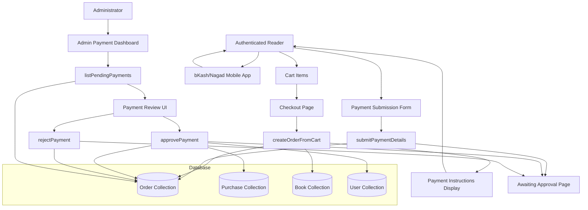
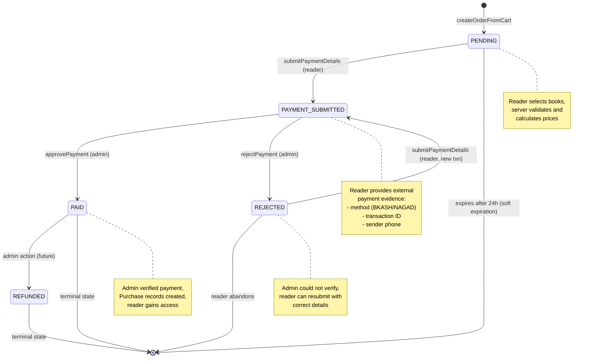
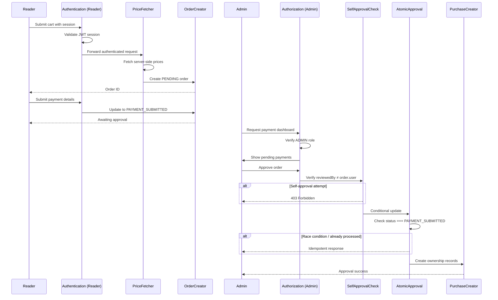

# Technical Design: Manual Payment Verification System

## Overview

The Manual Payment Verification System implements a complete checkout-to-ownership flow for purchasing digital ebooks through external bKash and Nagad mobile financial services (MFS), with manual administrative verification. This system eliminates automated payment gateway integration during MVP phase while establishing robust order management, payment validation, and ownership granting patterns that prepare the platform for future automated gateway integration.

### Core Architecture Principles

1. **Order ≠ Purchase**: Orders represent transient payment lifecycles (PENDING → PAYMENT_SUBMITTED → PAID/REJECTED), while Purchases represent durable, auditable digital ownership entitlements created ONLY after admin-verified payment success.

2. **Zero Client Trust**: All prices, payment statuses, and ownership grants are determined exclusively server-side. Clients supply only book identifiers and payment evidence; the server fetches current prices, validates eligibility, and administrators verify payment authenticity.

3. **Manual Verification Gateway**: Human administrators act as the trust boundary, manually verifying payment transactions against bKash/Nagad merchant accounts before granting digital ownership. This eliminates technical payment integration complexity while maintaining security rigor.

4. **Atomic Fulfillment**: Order approval uses MongoDB atomic operations to update order status and create all Purchase records, ensuring no partial fulfillment states.

5. **Self-Approval Prevention**: System enforces that administrators cannot approve their own orders, preventing internal fraud and maintaining separation of duties.

6. **Audit Trail Completeness**: Every order status transition records administrator identity, timestamp, and rationale (for rejections), creating comprehensive financial audit logs.

7. **Idempotent Operations**: Concurrent approval attempts, duplicate submissions, and retry scenarios are handled gracefully through atomic database operations and status state machines.

### MVP Scope Definition (Phase 6)

**In Scope:**
- Manual payment submission by readers (transaction ID + phone number)
- Admin payment verification dashboard and approval/rejection workflow
- Atomic Purchase creation upon approval
- BKASH and NAGAD payment methods with configurable merchant details
- Complete audit trail and logging
- Reader and admin UI pages
- Backward compatibility with existing MOCK orders

**Out of Scope (Deferred to Phase 12 or later):**
- Automated payment gateway integration (SSLCOMMERZ)
- Real-time payment status webhooks or callback processing
- Automated refunds
- Payment reconciliation reports
- Advanced fraud detection
- Multiple currency support
- Payment gateway API keys or credentials management

### Key Components

- **Checkout System**: Server-side order creation, validation, and price calculation
- **Payment Submission Interface**: Reader-facing UI for submitting external payment evidence
- **Admin Review Dashboard**: Administrator interface for payment verification and approval/rejection
- **Order Lifecycle Manager**: State machine controlling PENDING → PAYMENT_SUBMITTED → PAID/REJECTED transitions
- **Purchase Fulfillment Engine**: Atomic ownership record creation on approval
- **Payment Configuration Manager**: Admin-configurable bKash/Nagad account details and customer-facing payment instructions (no API integration)

### System Context Diagram



---

## Architecture

### Component Architecture

The payment system follows a layered architecture with clear separation between reader-facing checkout, admin verification, and data persistence:

```
┌─────────────────────────────────────────────────────────────┐
│                    Reader Presentation Layer                 │
│  (Checkout Page, Payment Instructions, Submission Form,      │
│   Status Pages: Awaiting/Success/Rejected)                   │
└─────────────────────┬───────────────────────────────────────┘
                      │
┌─────────────────────▼───────────────────────────────────────┐
│                  Admin Presentation Layer                    │
│  (Payment Review Dashboard, Approval/Rejection UI)           │
└─────────────────────┬───────────────────────────────────────┘
                      │
┌─────────────────────▼───────────────────────────────────────┐
│                   Orchestration Layer                        │
│  (Server Actions: createOrderFromCart, submitPaymentDetails, │
│   approvePayment, rejectPayment, listPendingPayments,        │
│   getOrderDetails)                                           │
└─────────────────────┬───────────────────────────────────────┘
                      │
┌─────────────────────▼───────────────────────────────────────┐
│                  Business Logic Layer                        │
│  (Order State Machine, Purchase Fulfillment,                 │
│   Authorization Guards, Validation Services)                 │
└─────────────────────┬───────────────────────────────────────┘
                      │
┌─────────────────────▼───────────────────────────────────────┐
│                   Persistence Layer                          │
│    (MongoDB Models: Order, Purchase, Book, User)             │
└─────────────────────────────────────────────────────────────┘
```

### Order Status State Machine

The order lifecycle follows a strict state machine with admin-gated transitions:



### Reader Interaction Matrix

This matrix documents all state transitions and valid user actions at each order status:

| Current Status | Reader Can View? | Reader Can Submit Payment? | Reader Can Resubmit? | Reader Owns Book? | Valid Next Status |
| --- | --- | --- | --- | --- | --- |
| PENDING | ✅ Yes | ✅ Yes | N/A | ❌ No | PAYMENT_SUBMITTED, expires |
| PAYMENT_SUBMITTED | ✅ Yes | ❌ No (awaiting admin) | ❌ No | ❌ No | PAID, REJECTED |
| REJECTED | ✅ Yes (shows reason) | ❌ No (use Resubmit) | ✅ Yes (new txn ID required) | ❌ No | PAYMENT_SUBMITTED |
| PAID | ✅ Yes (show receipt) | ❌ No (already paid) | ❌ No | ✅ Yes (access books) | REFUNDED (admin only, future) |

### Security Architecture

**Defense in Depth Layers**:

1. **Authentication Boundary**: All endpoints protected via `requireUser()` or `requireAdmin()` session helpers
2. **Authorization Boundary**: Order access verified via `order.user === session.user.id` for readers
3. **Role Authorization Boundary**: Admin actions gated via `requireAdmin()` with role check
4. **Self-Approval Prevention Boundary**: `reviewedBy !== order.user` enforced in approval logic
5. **Input Validation Boundary**: All inputs parsed through Zod schemas before processing
6. **Price Integrity Boundary**: All prices fetched server-side from Book model, client values rejected
7. **State Transition Boundary**: Atomic status checks prevent invalid state transitions
8. **Duplicate Purchase Prevention**: Database-level unique constraint on `{user: 1, book: 1}` (with status checks)
9. **Concurrent Approval Protection**: Atomic conditional updates prevent race conditions
10. **Audit Trail Boundary**: All admin actions logged with administrator identity and timestamp

#### Authorization Enforcement Checklist

- ✅ `requireUser()` enforces authentication on all reader-facing Server Actions (createOrderFromCart, submitPaymentDetails, getOrderDetails)
- ✅ `requireAdmin()` enforces admin role on all admin-only Server Actions (approvePayment, rejectPayment, listPendingPayments)
- ✅ Order ownership verified on all reader actions: `order.user === session.user.id`
- ✅ Self-approval prevention: `reviewedBy !== order.user` checked before approval
- ✅ Order expiration enforced: reject payment submission for orders > 24 hours old
- ✅ Status transition validation: only allow valid state transitions (PENDING→PAYMENT_SUBMITTED→PAID/REJECTED)
- ✅ Book eligibility: reject purchase if book status ≠ PUBLISHED
- ✅ Ownership check: prevent duplicate purchases with {user, book, status: ACTIVE} query
- ✅ Price tampering prevention: reject any client-submitted prices, calculate server-side only
- ✅ Concurrent approval atomic check: use conditional update with status filter to prevent duplicates

**Security Flow Diagram**:



---

## Data Models

### Order Model Enhancements (`src/models/Order.ts`)

**Status Enum** (updated):

```typescript
export type OrderStatus =
  | "PENDING"           // Created, awaiting reader payment
  | "PAYMENT_SUBMITTED" // Reader submitted payment evidence
  | "PAID"              // Admin approved, purchases created
  | "REJECTED"          // Admin rejected verification
  | "CANCELLED"         // Reader/admin cancelled before payment
  | "REFUNDED";         // Admin refunded after payment

export type PaymentMethod =
  | "BKASH"         // Manual bKash verification (MVP Phase 6)
  | "NAGAD"         // Manual Nagad verification (MVP Phase 6)
  | "MOCK"          // Development testing only (preserved for dev env)
  | "SSLCOMMERZ";   // Future automated gateway (Phase 12)

// Note: BKASH and NAGAD are the primary methods for MVP Phase 6 manual verification
// MOCK is preserved for development and testing environments
// SSLCOMMERZ is reserved for future automated integration (Phase 12)
// Existing orders with MOCK remain valid (backward compatibility maintained)
```

**Interface** (with new fields):

```typescript
export interface IOrder {
  // Existing fields preserved
  user: Types.ObjectId;
  items: IOrderItem[];
  subtotal: number;
  discount: number;
  total: number;
  currency: string;
  paymentMethod: PaymentMethod;
  status: OrderStatus;
  createdAt: Date;
  updatedAt: Date;
  
  // NEW: Payment submission fields (reader-provided evidence)
  submittedTransactionId?: string | null;  // External payment txn ID
  submittedPhoneNumber?: string | null;    // Sender phone number
  submittedAt?: Date | null;               // When reader submitted
  
  // NEW: Admin review fields (verification audit trail)
  reviewedBy?: Types.ObjectId | null;      // Admin user who reviewed
  reviewedAt?: Date | null;                // When admin reviewed
  rejectionReason?: string | null;         // Why rejected (if applicable)
  
  // NEW: Complete submission history for audit trail
  submissionHistory: ISubmissionEntry[];
}

interface ISubmissionEntry {
  transactionId: string;
  phoneNumber: string;
  submittedAt: Date;
  status: "SUBMITTED" | "REJECTED";
  rejectionReason?: string;
  reviewedBy?: Types.ObjectId;
  reviewedAt?: Date;
}
```

**Schema Updates**:

```typescript
const OrderSchema = new Schema<IOrderDocument>(
  {
    // ... existing fields ...
    
    paymentMethod: {
      type: String,
      enum: ["BKASH", "NAGAD", "MOCK", "SSLCOMMERZ"],
      required: true,
    },
    
    status: {
      type: String,
      enum: ["PENDING", "PAYMENT_SUBMITTED", "PAID", "REJECTED", "CANCELLED", "REFUNDED"],
      default: "PENDING",
      required: true,
      index: true,  // Index for dashboard queries
    },
    
    // Payment submission fields
    submittedTransactionId: {
      type: String,
      default: null,
      trim: true,
    },
    
    submittedPhoneNumber: {
      type: String,
      default: null,
      trim: true,
    },
    
    submittedAt: {
      type: Date,
      default: null,
    },
    
    // Admin review fields
    reviewedBy: {
      type: Schema.Types.ObjectId,
      ref: "User",
      default: null,
      index: true,  // Index for admin audit queries
    },
    
    reviewedAt: {
      type: Date,
      default: null,
    },
    
    rejectionReason: {
      type: String,
      default: null,
      trim: true,
    },
    
    // Audit trail for submission history
    submissionHistory: [{
      transactionId: { type: String, required: true },
      phoneNumber: { type: String, required: true },
      submittedAt: { type: Date, required: true },
      status: { type: String, enum: ["SUBMITTED", "REJECTED"], required: true },
      rejectionReason: String,
      reviewedBy: { type: Schema.Types.ObjectId, ref: "User" },
      reviewedAt: Date
    }],
  },
  {
    timestamps: true,
  }
);

// Compound index for admin dashboard queries
OrderSchema.index({ status: 1, submittedAt: -1 });

// Compound index for user order history
OrderSchema.index({ user: 1, createdAt: -1 });

// CRITICAL: Unique compound index for transaction ID protection
// Prevents duplicate transaction IDs within same payment method for PAYMENT_SUBMITTED/PAID status
OrderSchema.index(
  { 
    submittedTransactionId: 1, 
    paymentMethod: 1, 
    status: 1 
  },
  {
    unique: true,
    sparse: true,
    partialFilterExpression: {
      submittedTransactionId: { $ne: null },
      status: { $in: ["PAYMENT_SUBMITTED", "PAID"] }
    }
  }
);
```

### Purchase Model (`src/models/Purchase.ts`)

**Index Updates Required** — update model to support legitimate repurchases after refunds:

```typescript
// UPDATED: Unique constraint only for ACTIVE purchases
// Allows historical refunds/cancellations and legitimate repurchases
PurchaseSchema.index(
  { user: 1, book: 1 },
  {
    unique: true,
    partialFilterExpression: {
      status: "ACTIVE"
    }
  }
);

// Additional indexes for queries
PurchaseSchema.index({ user: 1, status: 1, purchasedAt: -1 });
PurchaseSchema.index({ order: 1 });
```

**Interface Remains Unchanged**:
- One-to-one mapping: `{user, book, order}`
- Status tracking: `"ACTIVE" | "REFUNDED" | "CANCELLED"`
- Audit timestamps: `purchasedAt`, `createdAt`, `updatedAt`

---

## Server Actions (`src/actions/checkout.ts`)

All checkout operations are exposed as Next.js Server Actions with `"use server"` directive.

### `createOrderFromCart(input: CreateOrderInput): Promise<OrderResponse>`

**Purpose**: Creates a PENDING order from cart items after validation and ownership checks.

**Input Validation**:
```typescript
const CreateOrderInput = z.object({
  items: z.array(
    z.object({
      bookId: z.string().regex(/^[0-9a-fA-F]{24}$/, "Invalid book ID format"),
      quantity: z.number().int().positive().default(1)
    })
  ).min(1, "Cart must contain at least one item")
   .max(50, "Maximum 50 items per order"),
  
  paymentMethod: z.enum(["BKASH", "NAGAD"], {
    errorMap: () => ({ message: "Payment method must be BKASH or NAGAD" })
  })
});

type CreateOrderInput = z.infer<typeof CreateOrderInput>;

interface OrderResponse {
  success: boolean;
  orderId?: string;
  error?: string;
}
```

**Process Flow**:
1. Parse input with Zod schema (validates `items` array and `paymentMethod`)
2. Authenticate user via `requireUser()`
3. For each cart item:
   - Fetch Book document from database
   - Verify book exists: if not found, reject with "Book not found: {bookId}"
   - Verify book status === "PUBLISHED": if DRAFT/ARCHIVED, reject with "Book not available: {title}"
   - Check ownership: query Purchase collection `{user: session.user.id, book: item.bookId, status: "ACTIVE"}`
   - If ACTIVE purchase exists, reject with "You already own: {title}"
4. Calculate prices using server-fetched data:
   ```typescript
   const itemPrice = book.discountPrice ?? book.price;
   const lineTotal = itemPrice * item.quantity;
   ```
   - `subtotal = sum(lineTotal for all items)`
   - `discount = 0` (Phase 6 baseline, no platform discounts)
   - `total = subtotal - discount`
5. Create Order document:
   ```typescript
   const order = await Order.create({
     user: session.user.id,
     items: items.map(item => ({
       book: fetchedBook._id,
       title: fetchedBook.title,
       price: fetchedBook.discountPrice ?? fetchedBook.price,
       quantity: item.quantity
     })),
     subtotal,
     discount,
     total,
     currency: "BDT",
     paymentMethod: input.paymentMethod,
     status: "PENDING",
     // Submission fields null until reader submits payment
     submittedTransactionId: null,
     submittedPhoneNumber: null,
     submittedAt: null,
     // Review fields null until admin reviews
     reviewedBy: null,
     reviewedAt: null,
     rejectionReason: null
   });
   ```
6. Log order creation: `console.log('Order created', {userId, orderId, itemCount, total})`
7. Return `{success: true, orderId: order._id.toString()}`

**Error Handling**:
- Zod validation failure: `{success: false, error: zodError.format()}`
- Book not found: `{success: false, error: "Book not found: {bookId}"}`
- Book not published: `{success: false, error: "Book not available for purchase: {title}"}`
- Already owned: `{success: false, error: "You already own: {title}"}`
- Database error: `{success: false, error: "Failed to create order. Please try again."}`

**Security Guarantees**:
- ✅ Authentication required (`requireUser()`)
- ✅ Server-fetched prices only (client-submitted prices rejected)
- ✅ Ownership check prevents duplicate purchases
- ✅ Book eligibility validation (PUBLISHED status)
- ✅ Input validation via Zod schema

**Logging**: Log user ID, order ID, item count, total amount on success.

---

### `submitPaymentDetails(input: SubmitPaymentInput): Promise<SubmitPaymentResponse>`

**Purpose**: Allows reader to submit external payment evidence after making payment via bKash/Nagad.

**Input Validation**:
```typescript
const SubmitPaymentInput = z.object({
  orderId: z.string().regex(/^[0-9a-fA-F]{24}$/, "Invalid order ID"),
  
  submittedTransactionId: z.string()
    .min(5, "Transaction ID too short")
    .max(100, "Transaction ID too long")
    .trim(),
  
  submittedPhoneNumber: z.string()
    .regex(/^01[3-9]\d{8}$/, "Invalid Bangladesh phone number format (must be 01XXXXXXXXX)")
    .trim()
});

type SubmitPaymentInput = z.infer<typeof SubmitPaymentInput>;

interface SubmitPaymentResponse {
  success: boolean;
  error?: string;
}
```

**Process Flow**:
1. Parse input with Zod schema
2. Authenticate user via `requireUser()`
3. Fetch Order by `orderId`
4. **Authorization Check**: Verify `order.user.toString() === session.user.id`
   - If mismatch: return `{success: false, error: "Access denied"}`
5. **State Validation**: Verify order status allows submission
   ```typescript
   const allowedStatuses = ["PENDING", "REJECTED"];
   if (!allowedStatuses.includes(order.status)) {
     if (order.status === "PAYMENT_SUBMITTED") {
       return {success: false, error: "Payment already submitted. Awaiting admin review."};
     }
     if (order.status === "PAID") {
       return {success: false, error: "Order already paid and completed."};
     }
     return {success: false, error: `Order cannot accept payment (status: ${order.status})`};
   }
   ```
6. **Expiration Check**: Verify order is not expired
   ```typescript
   const EXPIRATION_MS = 24 * 60 * 60 * 1000; // 24 hours
   const ageMs = Date.now() - order.createdAt.getTime();
   if (ageMs > EXPIRATION_MS) {
     const ageHours = Math.floor(ageMs / (1000 * 60 * 60));
     return {
       success: false,
       error: `Order expired (created ${ageHours}h ago). Please create a new order.`
     };
   }
   ```
7. **MongoDB Transaction with Duplicate Prevention**: Use proper database transaction for atomic submission
   ```typescript
   const session = await mongoose.startSession();
   
   try {
     const result = await session.withTransaction(async () => {
       // Check for duplicate transaction ID within transaction
       const duplicateCheck = await Order.findOne({
         user: { $ne: order.user }, // Different user
         submittedTransactionId: input.submittedTransactionId,
         paymentMethod: order.paymentMethod,
         status: { $in: ["PAYMENT_SUBMITTED", "PAID"] }
       }).session(session);
       
       if (duplicateCheck) {
         throw new Error("Transaction ID already used by another user");
       }
       
       // Create submission history entry
       const historyEntry = {
         transactionId: input.submittedTransactionId,
         phoneNumber: input.submittedPhoneNumber,
         submittedAt: new Date(),
         status: "SUBMITTED" as const
       };
       
       // Update order with submission details and add to history
       const updateResult = await Order.updateOne(
         { 
           _id: orderId,
           status: { $in: ["PENDING", "REJECTED"] } // Only allow from these states
         },
         {
           $set: {
             status: "PAYMENT_SUBMITTED",
             submittedTransactionId: input.submittedTransactionId,
             submittedPhoneNumber: input.submittedPhoneNumber,
             submittedAt: new Date()
           },
           $push: {
             submissionHistory: historyEntry
           }
         }
       ).session(session);
       
       if (updateResult.matchedCount === 0) {
         throw new Error("Order state changed or invalid transition");
       }
       
       return true;
     });
     
     if (result) {
       console.log('Payment submitted', {orderId, userId: session.user.id, transactionId: input.submittedTransactionId});
       return { success: true };
     }
   } catch (error) {
     if (error.message.includes("duplicate key") || error.message.includes("Transaction ID already used")) {
       return {
         success: false,
         error: "Transaction ID already used on another order"
       };
     }
     throw error; // Re-throw other errors for general error handler
   } finally {
     await session.endSession();
   }
   ```

- Zod validation failure: `{success: false, error: zodError.format()}`
- Order not found: `{success: false, error: "Order not found"}`
- Unauthorized: `{success: false, error: "Access denied"}`
- Invalid state: `{success: false, error: "Payment already submitted. Awaiting admin review."}`
- Expired order: `{success: false, error: "Order expired (created {hours}h ago). Please create a new order."}`
- Duplicate transaction ID: `{success: false, error: "Transaction ID already used on another order"}`
- Database error: `{success: false, error: "Failed to submit payment. Please try again."}`

**Security Guarantees**:
- ✅ Authentication required (`requireUser()`)
- ✅ Order ownership verified
- ✅ State transition validated (only PENDING/REJECTED → PAYMENT_SUBMITTED)
- ✅ Expiration enforced before submission
- ✅ Duplicate transaction ID prevention via unique compound index
- ✅ Input validation via Zod schema
- ✅ MongoDB transaction ensures atomicity
- ✅ Complete submission history preserved for audit trail

**Notes**:
- Reader can resubmit if order is REJECTED (allows correction of transaction ID errors)
- Transaction ID format not validated (varies between bKash/Nagad, admin verifies externally)
- Phone number validation accepts Bangladesh mobile format (01XXXXXXXXX)
- Unique compound index prevents transaction ID reuse across different users/payment methods
- Database transactions ensure atomic submission with duplicate prevention

---

### `approvePayment(orderId: string): Promise<ApprovePaymentResponse>`

**Purpose**: Admin action to verify external payment and atomically grant ebook ownership.

**Authorization**: Requires `requireAdmin()` — only users with `role: "ADMIN"` can execute.

**Input Validation**:
```typescript
const orderId = z.string()
  .regex(/^[0-9a-fA-F]{24}$/, "Invalid order ID")
  .parse(input);

interface ApprovePaymentResponse {
  success: boolean;
  error?: string;
  purchaseCount?: number;  // Number of purchases created
}
```

**Process Flow**:
1. Authenticate and authorize via `requireAdmin()`
   ```typescript
   const adminUser = await requireAdmin();
   // requireAdmin() internally calls requireUser() then checks role === "ADMIN"
   // Throws redirect to /forbidden if not admin
   ```
2. Fetch Order by `orderId` with `.populate('items.book')`
3. **Order Existence Check**: If not found, return `{success: false, error: "Order not found"}`
4. **Self-Approval Prevention**: Verify admin is not approving their own order
   ```typescript
   if (order.user.toString() === adminUser.id.toString()) {
     return {
       success: false,
       error: "Cannot approve your own order. Separation of duties required."
     };
   }
   ```
5. **State Validation**: Verify order status allows approval
   ```typescript
   if (order.status !== "PAYMENT_SUBMITTED") {
     if (order.status === "PAID") {
       // Idempotent check: verify fulfillment completed (FIX #2)
       const purchaseCount = await Purchase.countDocuments({
         order: orderId,
         status: "ACTIVE"
       });
       
       if (purchaseCount === order.items.length) {
         return {
           success: true,
           purchaseCount,
           message: "Order already approved and fulfilled"
         };
       } else {
         return {
           success: false,
           error: `Order marked PAID but incomplete fulfillment (${purchaseCount}/${order.items.length} purchases). Contact support.`
         };
       }
     }
     
     return {
       success: false,
       error: `Order cannot be approved (status: ${order.status}). Only PAYMENT_SUBMITTED orders can be approved.`
     };
   }
   ```
6. **MongoDB Transaction for Atomic Approval**: Use proper database transaction for atomic fulfillment
   ```typescript
   const session = await mongoose.startSession();
   
   try {
     const result = await session.withTransaction(async () => {
       // Atomic status update with conditional check
       const updateResult = await Order.updateOne(
         {
           _id: orderId,
           status: "PAYMENT_SUBMITTED"  // Only update if still in correct state
         },
         {
           $set: {
             status: "PAID",
             reviewedBy: adminUser.id,
             reviewedAt: new Date()
           },
           $push: {
             submissionHistory: {
               $each: [{
                 transactionId: order.submittedTransactionId,
                 phoneNumber: order.submittedPhoneNumber,
                 submittedAt: order.submittedAt,
                 status: "APPROVED",
                 reviewedBy: adminUser.id,
                 reviewedAt: new Date()
               }]
             }
           }
         }
       ).session(session);
       
       if (updateResult.matchedCount === 0) {
         // Check current state for proper error message
         const currentOrder = await Order.findById(orderId).session(session);
         if (currentOrder.status === "PAID") {
           // Already approved - verify fulfillment completed
           const purchaseCount = await Purchase.countDocuments({
             order: orderId,
             status: "ACTIVE"
           }).session(session);
           
           if (purchaseCount === order.items.length) {
             return { idempotent: true, purchaseCount };
           } else {
             throw new Error(`Order marked PAID but incomplete fulfillment (${purchaseCount}/${order.items.length} purchases)`);
           }
         } else {
           throw new Error(`Order status changed to ${currentOrder.status}. Cannot approve.`);
         }
       }
       
       // Create Purchase records with duplicate prevention
       const purchases = [];
       for (const item of order.items) {
         // Verify book still exists
         const book = await Book.findById(item.book).session(session);
         if (!book) {
           throw new Error(`Book ${item.book} not found during fulfillment`);
         }
         
         // Check for existing ACTIVE purchase (idempotent duplicate prevention)
         const existingPurchase = await Purchase.findOne({
           user: order.user,
           book: item.book,
           status: "ACTIVE"
         }).session(session);
         
         if (existingPurchase) {
           // Skip duplicate (idempotent - user already owns this book)
           console.warn(`Duplicate purchase detected: user ${order.user} already owns book ${item.book}`);
           continue;
         }
         
         // Create purchase within transaction
         const purchase = await Purchase.create([{
           user: order.user,
           book: item.book,
           order: order._id,
           price: item.price,
           currency: order.currency,
           status: "ACTIVE",
           purchasedAt: new Date()
         }], { session });
         
         purchases.push(purchase[0]);
       }
       
       return { purchaseCount: purchases.length };
     });
     
     if (result.idempotent) {
       console.log('Order already approved (idempotent)', {orderId, adminId: adminUser.id, purchaseCount: result.purchaseCount});
       return {
         success: true,
         purchaseCount: result.purchaseCount,
         message: "Order already approved and fulfilled"
       };
     }
     
     console.log('Order approved', {orderId, adminId: adminUser.id, userId: order.user, purchaseCount: result.purchaseCount, totalAmount: order.total});
     return { success: true, purchaseCount: result.purchaseCount };
     
   } catch (error) {
     console.error('Approval transaction failed', {orderId, adminId: adminUser.id, error: error.message});
     
     if (error.message.includes("incomplete fulfillment")) {
       return { success: false, error: error.message + ". Contact support." };
     }
     
     if (error.message.includes("status changed")) {
       return { success: false, error: error.message };
     }
     
     if (error.message.includes("not found during fulfillment")) {
       return { success: false, error: error.message };
     }
     
     return {
       success: false,
       error: "Failed to approve order. Please try again."
     };
   } finally {
     await session.endSession();
   }
   ```

**Error Handling**:
- Not authenticated/authorized: Redirect to `/forbidden` (thrown by `requireAdmin()`)
- Order not found: `{success: false, error: "Order not found"}`
- Self-approval attempt: `{success: false, error: "Cannot approve your own order"}`
- Invalid state: `{success: false, error: "Order cannot be approved (status: {status})"}`
- Book deleted during fulfillment: `{success: false, error: "Book {bookId} not found during fulfillment"}`

**Security Guarantees**:
- ✅ Admin authorization required (`requireAdmin()`)
- ✅ Self-approval prevention (reviewedBy ≠ order.user with proper ObjectId.toString() comparison)
- ✅ MongoDB transaction ensures atomicity (order update + purchase creation)
- ✅ Concurrent approval protection (transaction rollback on conflicts)
- ✅ Idempotent approval (already-PAID orders return success with verification)
- ✅ Duplicate purchase prevention (check existing ACTIVE purchases within transaction)
- ✅ Audit trail recorded (reviewedBy, reviewedAt, submission history updated)

**Logging**: Log order ID, admin ID, user ID, purchase count, total amount on success.

---

### `rejectPayment(input: RejectPaymentInput): Promise<RejectPaymentResponse>`

**Purpose**: Admin action to reject payment verification with documented reason.

**Authorization**: Requires `requireAdmin()` — only users with `role: "ADMIN"` can execute.

**Input Validation**:
```typescript
const RejectPaymentInput = z.object({
  orderId: z.string().regex(/^[0-9a-fA-F]{24}$/, "Invalid order ID"),
  
  rejectionReason: z.string()
    .min(10, "Rejection reason must be at least 10 characters")
    .max(500, "Rejection reason too long")
    .trim()
});

type RejectPaymentInput = z.infer<typeof RejectPaymentInput>;

interface RejectPaymentResponse {
  success: boolean;
  error?: string;
}
```

**Process Flow**:
1. Parse input with Zod schema
2. Authenticate and authorize via `requireAdmin()`
3. Fetch Order by `orderId`
4. **Order Existence Check**: If not found, return `{success: false, error: "Order not found"}`
5. **Self-Rejection Prevention**: Verify admin is not rejecting their own order
   ```typescript
   if (order.user.toString() === adminUser.id.toString()) {
     return {
       success: false,
       error: "Cannot reject your own order. Separation of duties required."
     };
   }
   ```
6. **State Validation**: Verify order status allows rejection
   ```typescript
   if (order.status !== "PAYMENT_SUBMITTED") {
     if (order.status === "REJECTED") {
       return {success: true, message: "Order already rejected"};
     }
     
     if (order.status === "PAID") {
       return {
         success: false,
         error: "Cannot reject paid order. Use refund process instead."
       };
     }
     
     return {
       success: false,
       error: `Order cannot be rejected (status: ${order.status})`
     };
   }
   ```
7. **Update Order with Rejection and History** (atomic operation):
   ```typescript
   const session = await mongoose.startSession();
   
   try {
     const result = await session.withTransaction(async () => {
       // Add rejection entry to submission history
       const historyEntry = {
         transactionId: order.submittedTransactionId,
         phoneNumber: order.submittedPhoneNumber,
         submittedAt: order.submittedAt,
         status: "REJECTED" as const,
         rejectionReason: input.rejectionReason,
         reviewedBy: adminUser.id,
         reviewedAt: new Date()
       };
       
       const updateResult = await Order.updateOne(
         {
           _id: orderId,
           status: "PAYMENT_SUBMITTED"  // Conditional update for concurrency safety
         },
         {
           $set: {
             status: "REJECTED",
             reviewedBy: adminUser.id,
             reviewedAt: new Date(),
             rejectionReason: input.rejectionReason
           },
           $push: {
             submissionHistory: historyEntry
           }
         }
       ).session(session);
       
       if (updateResult.matchedCount === 0) {
         const currentOrder = await Order.findById(orderId).session(session);
         throw new Error(`Order status changed to ${currentOrder.status}. Cannot reject.`);
       }
       
       return true;
     });
     
     if (result) {
       console.log('Order rejected', {orderId, adminId: adminUser.id, userId: order.user, reason: input.rejectionReason});
       return { success: true };
     }
   } catch (error) {
     if (error.message.includes("status changed")) {
       return { success: false, error: error.message };
     }
     
     return {
       success: false,
       error: "Failed to reject order. Please try again."
     };
   } finally {
     await session.endSession();
   }
   ```

**Error Handling**:
- Zod validation failure: `{success: false, error: zodError.format()}`
- Not authenticated/authorized: Redirect to `/forbidden` (thrown by `requireAdmin()`)
- Order not found: `{success: false, error: "Order not found"}`
- Self-rejection attempt: `{success: false, error: "Cannot reject your own order"}`
- Invalid state: `{success: false, error: "Order cannot be rejected (status: {status})"}`
- Database error: `{success: false, error: "Failed to reject order. Please try again."}`

**Security Guarantees**:
- ✅ Admin authorization required (`requireAdmin()`)
- ✅ Self-rejection prevention (reviewedBy ≠ order.user with proper ObjectId.toString() comparison)
- ✅ MongoDB transaction for atomic rejection with history update
- ✅ Conditional update for concurrency safety (transaction rollback on conflicts)
- ✅ Audit trail recorded (reviewedBy, reviewedAt, rejectionReason, submission history updated)

**Logging**: Log order ID, admin ID, user ID, rejection reason on success.

---

### `listPendingPayments(): Promise<PendingPaymentsResponse>`

**Purpose**: Returns list of orders awaiting admin payment review.

**Authorization**: Requires `requireAdmin()` — only users with `role: "ADMIN"` can execute.

**Response Type**:
```typescript
interface PendingPayment {
  orderId: string;
  userEmail: string;
  userName: string;
  items: Array<{ title: string; price: number; quantity: number }>;
  total: number;
  paymentMethod: "BKASH" | "NAGAD";
  transactionId: string;
  phoneNumber: string;
  submittedAt: Date;
  hoursAgo: number;
}

interface PendingPaymentsResponse {
  success: boolean;
  payments: PendingPayment[];
  totalCount: number;
  error?: string;
}
```

**Process Flow**:
1. Authenticate and authorize via `requireAdmin()`
2. Query Order collection: `{status: "PAYMENT_SUBMITTED"}`, sorted by `submittedAt: -1`
3. Populate user, book references for display
4. Calculate `hoursAgo` from submittedAt
5. Format and return payment list
6. Log dashboard access: `console.log('Admin accessed payment dashboard', {adminId, paymentCount})`

**Error Handling**:
- Not authenticated/authorized: Redirect to `/forbidden` (thrown by `requireAdmin()`)
- Database error: `{success: false, error: "Failed to fetch pending payments"}`
- Transaction isolation: All queries use proper session for consistency

---

### `getOrderDetails(orderId: string): Promise<OrderDetailsResponse>`

**Purpose**: Returns complete order details for reader or admin view.

**Authorization**: Requires `requireUser()` for readers (own orders only) or `requireAdmin()` for admins (any order).

**Response Type**:
```typescript
interface OrderDetailsResponse {
  success: boolean;
  order?: {
    orderId: string;
    user: { id: string; name: string; email: string };
    items: Array<{ bookId: string; title: string; price: number; quantity: number }>;
    subtotal: number;
    discount: number;
    total: number;
    currency: string;
    paymentMethod: string;
    status: string;
    submittedTransactionId?: string | null;
    submittedPhoneNumber?: string | null;
    submittedAt?: Date | null;
    reviewedBy?: { id: string; name: string } | null;
    reviewedAt?: Date | null;
    rejectionReason?: string | null;
    createdAt: Date;
  };
  error?: string;
}
```

**Process Flow**:
1. Authenticate user via `requireUser()`
2. Fetch Order by `orderId` with populated references
3. If reader: verify `order.user === session.user.id`, return order or 403
4. If admin: verify `requireAdmin()`, return full order with admin fields
5. Return order details

---

## UI Component Specifications

### 1. Checkout Page (`/checkout/[orderId]`)

**Protected**: Requires `requireUser()` + order ownership verification

**Content**:
- Order summary (items with cover images, titles, authors, prices, quantities)
- Subtotal, discount, total (formatted with ৳ symbol and thousand separators)
- Payment method display (BKASH or NAGAD - selected during cart creation)
- Payment instructions (configurable per method):
  - bKash: Account number, reference code, amount to send
  - Nagad: Account number, reference code, amount to send
- Payment submission form:
  - Transaction ID input (validation hint: "From your payment app")
  - Sender phone number input (validation: 01XXXXXXXXX format)
  - Submit button

**Behavior**:
- On form submit: Call `submitPaymentDetails` Server Action
- On success: Redirect to `/checkout/submitted/[orderId]`
- On error: Display error message, allow retry

---

### 2. Awaiting Approval Page (`/checkout/submitted/[orderId]`)

**Protected**: Requires `requireUser()` + order ownership verification

**Content**:
- "Payment Under Review" heading with order ID
- Order summary (read-only)
- Submission timestamp
- Estimated review timeline ("Usually reviewed within 2-24 hours")
- Payment method and transaction ID (last 4 digits only for security)
- "Check Status" button (refresh page)
- "Back to Catalog" link

**Polling** (optional):
- Auto-refresh page every 30 seconds OR provide manual refresh button
- Display status: PAYMENT_SUBMITTED (awaiting) → PAID (redirect to success) → REJECTED (redirect to rejection page)

---

### 3. Payment Success Page (`/checkout/success/[orderId]`)

**Protected**: Requires `requireUser()` + order ownership verification

**Content**:
- "Payment Approved!" heading with checkmark icon
- Order summary (items, total paid)
- "Your books are now in your library. Start reading!"
- "View My Library" button linking to `/account`
- "Continue Shopping" button linking to `/books`

**Verification**: 
- Fetch order, verify status is PAID
- If not PAID, redirect to appropriate status page

---

### 4. Payment Rejection Page (`/checkout/rejected/[orderId]`)

**Protected**: Requires `requireUser()` + order ownership verification

**Content**:
- "Payment Not Approved" heading with error icon
- Admin rejection reason (displayed prominently)
- Explanation: "The payment could not be verified. Please review the reason above and resubmit with correct details."
- Order summary (items, total, rejection timestamp)
- "Resubmit Payment" button returning to `/checkout/[orderId]`
- "Back to Catalog" button linking to `/books`

**Verification**:
- Fetch order, verify status is REJECTED
- If not REJECTED, redirect to appropriate status page

---

### 5. Admin Payment Dashboard (`/admin/payments`)

**Protected**: Requires `requireAdmin()`

**Content**:
- "Payment Review Dashboard" heading with pending count
- Filter options: Payment method (BKASH/NAGAD), date range
- Sortable table: Order ID, Reader Email, Books (count), Total (৳), Method, Submitted Time
- Each row clickable, expanding to detail view
- Pagination: 25/50/100 per page

**Detail View** (expandable row or modal):
- Full order details (items, prices, totals)
- Reader information
- Payment method and transaction ID
- Sender phone number
- Submission timestamp
- Approval buttons: "Approve", "Reject"
- Rejection form (appears when "Reject" clicked):
  - Reason input (10-500 chars)
  - Submit/Cancel buttons

**Approval Flow**:
- Click "Approve": Show confirmation ("Approve payment for {reader name} - ৳{total}?")
- Call `approvePayment` Server Action
- On success: Remove row from list, show success toast
- On error: Show error message, stay in detail view

**Rejection Flow**:
- Click "Reject": Expand rejection reason form
- Enter reason and submit
- Call `rejectPayment` Server Action
- On success: Remove row from list, show success toast
- On error: Show error message, stay in form

---

## Error Handling

**Client-Side**:
- Form validation (Zod schema validation errors)
- Display formatted error messages
- Allow retry

**Server-Side**:
- Database operation failures: Log error, return generic message
- Order not found: Return "Order not found"
- Authorization failures: Return 403 or redirect to /forbidden
- Concurrent approval: Handle idempotently, return success

**User-Facing Error Messages**:
- "Order not found"
- "Access denied"
- "Payment already submitted. Awaiting admin review."
- "Order already paid and completed."
- "Order expired (created {hours}h ago). Please create a new order."
- "Book not available for purchase: {title}"
- "You already own: {title}"
- "Transaction ID already used on another order"
- "Failed to create order. Please try again."
- "Failed to submit payment. Please try again."
- "Cannot approve your own order. Separation of duties required."
- "Order already approved and fulfilled"
- "Failed to approve order. Please try again."

---

## Testing Strategy

### Manual Testing Scenarios

1. **Successful Purchase Flow**
   - Create order → Submit payment → Admin approves → Reader gains access
   - Verify: Purchases created, reader can see books in library

2. **Failed Payment Rejection**
   - Create order → Submit payment → Admin rejects with reason → Reader sees rejection
   - Verify: Rejection reason displayed, reader can resubmit

3. **Rejected Payment Resubmission**
   - Create order → Submit payment → Admin rejects → Reader resubmits with new transaction ID
   - Verify: New submission recorded, resubmission allowed

4. **Duplicate Transaction ID Detection**
   - Submit payment with transaction ID → Attempt resubmit on different order with same ID
   - Verify: Error returned preventing duplicate

5. **Concurrent Admin Approvals**
   - Two admins simultaneously approve same order
   - Verify: Only one approval succeeds, second is idempotent, no duplicate purchases

6. **Self-Approval Prevention**
   - Admin creates order as themselves → Attempts to approve own order
   - Verify: Error returned preventing self-approval

7. **Price Tampering Attempt**
   - Modify cart item prices in browser developer tools
   - Verify: Server-fetched prices used, tampered prices ignored

8. **Already-Owned Book Checkout**
   - Purchase book → Create new order with same book
   - Verify: Error returned preventing duplicate purchase

---

## Implementation Phases

### Phase 6A: Data Model & Core Server Actions
- Update Order model with new fields (8 new fields including submissionHistory array)
- Add unique compound index for transaction ID protection with partialFilterExpression
- Update Purchase model unique index with partialFilterExpression for ACTIVE status only
- Create server actions: createOrderFromCart, submitPaymentDetails, approvePayment, rejectPayment, listPendingPayments, getOrderDetails
- Implement MongoDB transactions for atomic operations (submitPaymentDetails, approvePayment, rejectPayment)
- Implement validation and authorization with proper ObjectId.toString() comparisons
- Add error handling and logging

### Phase 6B: Reader UI Pages
- Implement Checkout page with payment instructions
- Implement Payment Submission form
- Implement Awaiting Approval, Success, and Rejection pages
- Add client-side form validation

### Phase 6C: Admin UI Pages
- Implement Admin Payment Dashboard
- Implement order detail view and approval/rejection UI
- Add filtering and pagination
- Add success/error notifications

### Phase 6D: Testing & Verification
- Manual testing of all scenarios including transaction rollback scenarios
- Integration testing with test database using MongoDB transactions
- Security review and penetration testing
- Performance testing under concurrent load with proper transaction isolation
- Database index optimization and query performance validation

